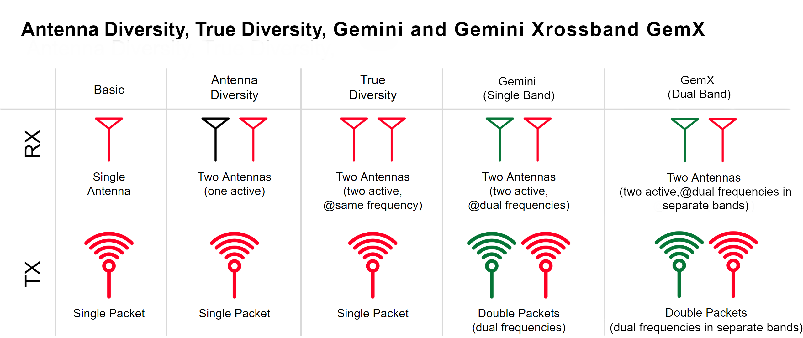

## What is Gemini

Gemini is a dual channel 2.4GHz or 900MHz system. However, it is NOT Dual Band.

In Gemini Mode, a TX module simultaneously transmits a packet in two frequencies 40MHz apart. A true diversity Receiver is used to receive both packets simultaneously. Transmitting on 2 separate frequencies provides better interference avoidance and/or mitigation, in a similar way DVDA does by sending repeat packets sequentially on different frequencies. This means, the Receiver has increased chance in receiving the packet. This results in a much stable LQ.

<figure markdown>
<iframe width="640" height="390" src="https://www.youtube.com/embed/VcC50cX3a7E?si=qao7AO_M5Ykbn2jI" title="YouTube video player" frameborder="0" allow="accelerometer; autoplay; clipboard-write; encrypted-media; gyroscope; picture-in-picture; web-share" allowfullscreen></iframe>
</figure>

<figure markdown>

</figure>