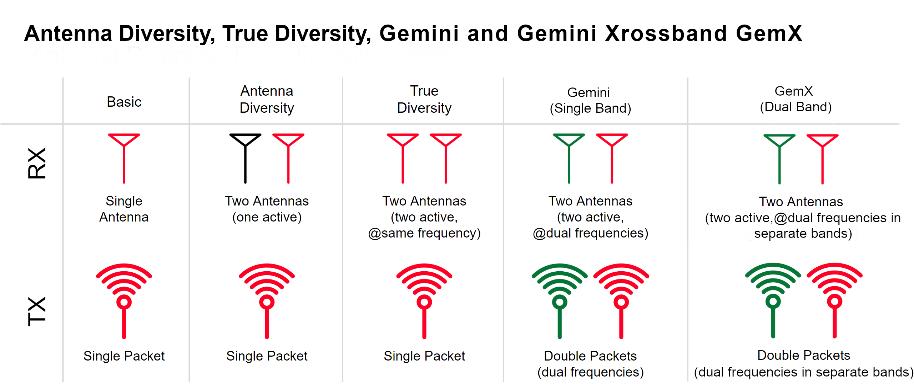

## What is Gemini?

Gemini is a dual channel 2.4GHz and/or 900MHz (and potentially other low-band frequencies) transmission mode that leverages true diversity hardware to maximize LQ.

There's single-band Gemini; which uses diversity hardware to transmit in multiple channels within the same band (2.4GHz or 900MHz) and there's also Gemini Xrossband (Crossband; i.e. dual-band) which is capable of transmitting on both 2.4GHz and 900MHz bands simultaneously using two LR1121 transceivers.

In single-band Gemini Mode, a TX module simultaneously transmits a packet in two frequencies 40MHz apart for 2.4GHz and ~10MHz apart for 900MHz users. The packet separation used is half of the frequency domain selected and will vary a little.

In dual-band GemX Mode (e.g. X150 or X100 Full Res), a TX module transmits a packet in SubGHz (900MHz) via Antenna 1 and in 2.4GHz via Antenna 2. 

A true diversity Receiver is used to receive both packets simultaneously.

Transmitting on 2 separate frequencies provides better interference avoidance and/or mitigation, in a similar way DVDA does by sending repeat packets sequentially on different frequencies. This means, the Receiver has an increased chance of receiving the packet. This results in a much higher and stable LQ.

## Setup

**Via Lua set your TX AND RX Antenna Modes to Gemini.**

Use [Model Config Matching](model-config-match.md) to set the correct antenna mode based on the active Model on the radio.
e.g. use Model 5 for single antenna receivers, Model 6 for Gemini-capable receivers.

## Introductory Video and Testing

<figure markdown>
<iframe width="640" height="390" src="https://www.youtube.com/embed/VcC50cX3a7E?si=qao7AO_M5Ykbn2jI" title="YouTube video player" frameborder="0" allow="accelerometer; autoplay; clipboard-write; encrypted-media; gyroscope; picture-in-picture; web-share" allowfullscreen></iframe>
</figure>

## What about using Gemini with DVDA?

Gemini doubles the redundancy of DVDA modes.  For example, D500 sends 2 repeat packets on 2 different frequencies. When using D500 with a Gemini TX you will now have 4 packets sent across 4 different frequencies.

When using D250 which sends 4 repeat packets across 3 frequencies.  With Gemini you will now have 8 repeat packets across 6 different frequencies.

## What are the Benefits?

### Freestylers

Flying in urban environments with lots of RF noise? Gemini will help to dodge the interference and maintain a strong link.

### Racers

Flying at events with 6 to 8 up racers, plus who knows how many handsets left powered up in the pits, can cause your precious link to take a hit.  Gemini is an obvious choice for these environments when every packet counts.

### Lovers of Telemetry

A Gemini TX has the advantage of not only sending simultaneous packets, but also receiving simultaneous packets.  Or when used in single antenna mode (or switch mode) both antennas will listen for the same TLM packet, in the same way a diversity RX listens for RC packets.  So your TLM link becomes stronger with fewer missed packets, even when not used in Gemini mode and with single antenna receivers.

### AirPort and MAVLink users

For data links a single missed packet can mean more than 1 missed packet. If a single packet is missed, this means the rest of the data that was received for that MAVLink packet is now wasted. As the MAVLink packet may have been split across multiple OTA packets and will not be complete. The single missed packet can turn into 10 packets missed. Gemini will help with making sure you get the highest MAVLink packet rate possible!

## Will Gemini increase my range?

No. The packet sensitivity remains the same for the RF Mode (or Packet Rate) used.  Gemini will help maintain a higher LQ to the point of failsafe.  However failsafe will still happen at approximately the same distance e.g. the moon.

## Comparison with other Antenna Modes

<figure markdown>

</figure>

## Gemini Xrossband

Gemini Xrossband or GemX is capable of transmitting on both 2.4GHz and 900MHz bands simultaneously. It is available to ExpressLRS devices with 2 LR1121 RF chipsets. In X-modes (X100 Full Res or X150), one RF circuit (typically designated as Antenna 1) operates in SubGHz (mainly 900MHz) and the other (typically designated as Antenna 2) operates in 2.4GHz. In X-modes, Antenna Mode option will be locked to `Gemini` since you need both RF paths to be working simultaneously. 

A GemX-capable receiver will be required for this mode, and any single-band receiver will not get a sync.

## Is there antenna switching with Gemini? Can Antenna 1 of Receiver talk with Antenna 2 of TX if they are in the same polarization during a flight?

Yes, there is antenna switching.

## What happens if I use a Gemini TX, in Gemini Mode, with a single Antenna Receiver?

The Gemini TX will function as designed, in Gemini Mode. The Receiver will only get the signal from the TX it has synchronized with. The other TX will still transmit uselessly in the other frequency.

In ExpressLRS 4.0, this is automatically managed by the TX module, changing the mode depending on the Receiver in sync.

## What happens if I use a Gemini TX, in Gemini Mode, with Gemini-incapable Diversity Receivers?

As above, with the Receiver antennas only getting sync from one TX. We recommend setting the TX to non-Gemini Modes.

## How does a Gemini RX behave when paired with a non-Gemini TX?

The Receiver will still listen on both Antennas, but only get sync on one. Both RX will send out Telemetry, but only one of them will be used.
