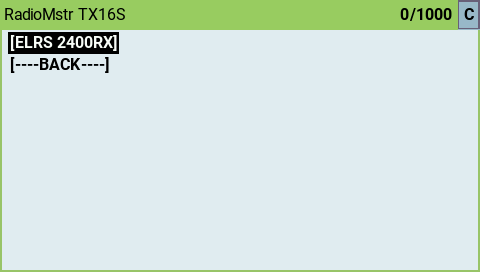

## Loan Model

!!! note "Scenario"
    You are flying with your buddies and your friend has crashed all his models. You'd like to be able to lend him one of yours but you
    can't because it's using a binding phrase, so he's relegated to being the crashed model fetcher for the rest of the day!

    No longer is he destined to be running to the bando and back again fetching downed quads. You can use the "Loan Model" feature and lend him one of your models!

## How to "Loan Model"

### On the lenders handset

* Connect to the model you wish to loan out with your handset
* Enter the LUA screen and select "Other Devices" at the bottom of the list

<figure markdown>

</figure>

* Choose the RX from the list

<figure markdown>

</figure>

* Select the "Loan Model" entry

<figure markdown>

</figure>

* The receiver LED should go into the bind flashing state

<figure markdown>

</figure>

### On the borrowers handset
* From the main ExpressLRS LUA screen select `[Bind]`
* The receiver LED should turn solid on, and the handset should connect to the recevier

<figure markdown>

</figure>

## Returning a "Loaned" Model

There are a couple of ways to return a model to the owner. 

The first method is for the borrower to return it from the LUA script as follows:

* On the borrowers handset, connect to the "loaned" model
* Enter the LUA screen and select "Other Devices" at the bottom of the list

<figure markdown>

</figure>

* Choose the RX from the list

<figure markdown>

</figure>

* Select the "Return Model" entry

<figure markdown>

</figure>

The second method used if the borrower forgets to return the model, is as follows:

1. Power cycle the model 3 times in rapid succession, turning it off each time after the LED flashes on and off again.
2. If done correctly, the model will return to the state where it is bound to your transmitter.

!!! note
    If the LED returns to normal flashing between reboots, the counter is reset to 0 and you must restart the process.

## Bump to Loan

On transmitter modules with an accelerometer (such as the Axis Thor), you can loan and return a model by bumping it to another transmitter. 

The process is easy - simply hold both the lender and the borrower's transmitters vertically while a model is connected and not armed and bump them together. 

!!! note
    If the borrower does not have an accelerometer, the borrower must go into binding mode manually.