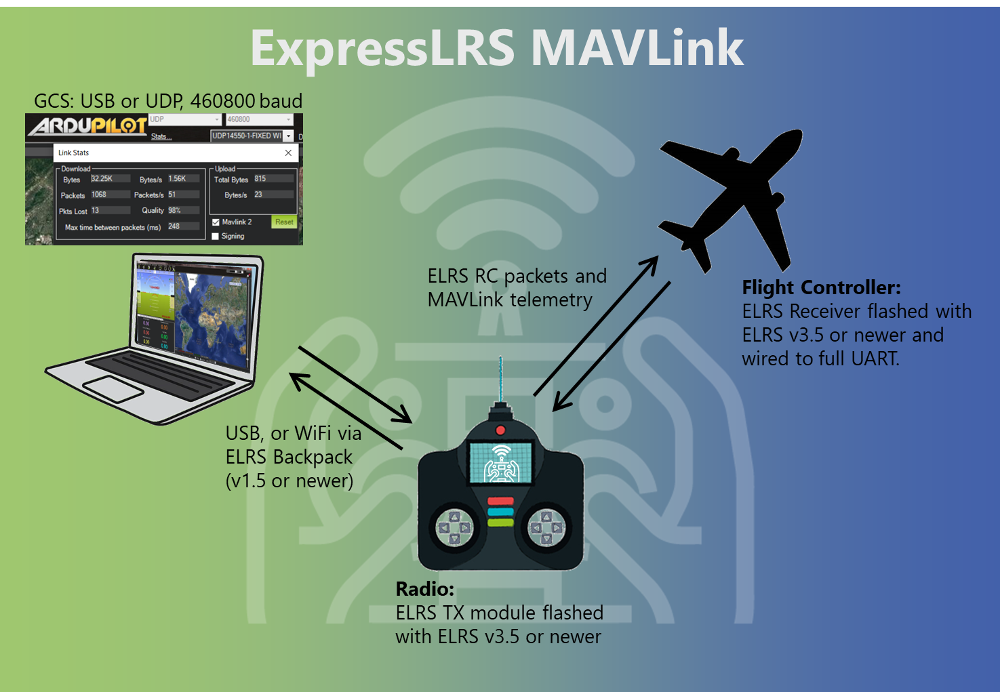

!!! note "NOTE"
    Enabling MAVLink forces the use of Hybrid or 16ch/2 switch mode. Wide switch mode is not supported.
    Enabling MAVLink forces a telemetry ratio of 1:2

## Overview

ExpressLRS provides full bi-directional [MAVLink](https://mavlink.io/en/) support, enabling both native MAVLink telemetry downlink **and** RC control uplink over a single radio link. This integration allows you to use ExpressLRS hardware as a complete replacement for traditional telemetry radios while maintaining RC control functionality.

<figure markdown>

</figure>

### Key Benefits

- **Single radio link and UART** for both RC control and telemetry (no separate telemetry radio needed), and only one UART is needed on the flight controller for both RC and telemetry
- **Better range** than traditional telemetry radios thanks to LoRa modes
- **Stubborn sender** ELRS uses its stubborn telemetry sender system for MAVLink messages - this system retries packets that weren't delivered, keeping MAVLink link quality high over longer distances and/or with interference. This ensures reliable delivery of MAVLink messages, even in situations where there is significant packet loss
- **Full parameter editing** and mission planning support
- **Compatible with all major GCS software** (Mission Planner, QGroundControl, etc.)

## Hardware Requirements

To start using MAVLink, you just need one ESP based ELRS transmitter, and one ESP based ELRS receiver. The majority of recent ELRS hardware is ESP based, and will be compatible with MAVLink. An easy way to check is, if the RX/TX have WiFi, then it is ESP based. STM32 based hardware cannot support running MAVLink mode.

!!! danger "900MHz Performance Warning"
    **It is STRONGLY suggested that you avoid using MAVLink mode with single-band 900MHz hardware. If you are planning to use 915/868MHz ELRS hardware, MAVLink will be SIGNIFICANTLY slower than with 2.4GHz or dual-band 900MHz.** This is due to the much lower data rates available on legacy 900MHz hardware.
    
    **Expected performance on legacy (single-band) 900MHz:**
    
    - At the 200Hz packet rate with 1:2 telemetry ratio: ~400 bps (bits per second)
    - At 100Hz Full packet rate with 1:2 telemetry ratio: ~400 bps
    - At any of the lower rates: Unusable data speeds, don't even bother.
    - Parameter downloading at 200Hz takes **2+ minutes**
    
    For comparison, with dual-band hardware at K1000Hz (which still uses the 900mhz band) the data rate is ~4000 bps, and parameter download takes ~4 seconds.
    
    **Recommendation:** Use 2.4GHz or dual-band (LR1121) hardware for MAVLink whenever possible. If you must use the older 900MHz hardware, be prepared for very slow data transfers.

!!! note "NOTE: Internal TX modules"
    If you are using an internal TX module (e.g. a TX16S with internal ELRS), you will be required to use the TX Backpack to connect to you GCS via WiFi (USB cable between the TX and the PC is not an option for internal modules). See WiFi Connectivity below.

## Flashing ELRS for MAVLink

Ensure both your transmitter module, the embedded TX-Backpack (if using WiFi forwarding), and your receiver are up to date with the latest release versions:

- For the main ELRS firmware, follow the [Firmware Update Guide](https://www.expresslrs.org/quick-start/getting-started/) for detailed instructions.
- For the TX-Backpack, follow the [Transmitter Backpack Firmware Guide](https://www.expresslrs.org/hardware/backpack/backpack-tx-setup/) for detailed instructions.

The minimum versions to use this feature are:
- Transmitter / receiver firmware: `3.5.0`
- TX Backpack firmware: `1.5.0`

## Configuring ELRS TX & RX for MAVLink

1. Turn on both the RX and TX, and ensure they connect properly.

1. For ELRS v3, In ELRS LUA script, select `Other Devices`, select your receiver, and set the `serial protocol` to `MAVLink`. This configures the RX to output MAVLink protocol on the UART.  For ELRS v4 RX protocol is now configured automatically when changing the TX mode to MAVLink.
   
1. First turn off your receiver, link mode cannot be changed when connected. In the main menu select the `Link Mode` option. Change it from `Normal` to `MAVLink`. This configures the TX module to send / receive MAVLink.

1. Configure your usual power, packet rate, etc. The telemetry ratio will be preset to 1:2 (and cannot be changed while in MAVLink mode).

1. Power on your receiver and verify it connects properly to the transmitter.

1. Wire the RX to a free UART on your flight controller that is suitable for TLM + RC. A DMA-capable UART is recommended.

## Flight Controller Setup

=== "ArduPilot"
    For the below steps, when a UART connection is mentioned, it will be written as `SERIALx`. Replace `x` with the UART number you are using.

    1. Configure `SERIALx_PROTOCOL=2`, `SERIALx_BAUD=460`, and `RSSI_TYPE=5`
    1. Save parameters and reboot the flight controller

=== "PX4"
    For the below steps, when a UART connection is mentioned, it will be written as `SER_TELx`. Replace `x` with the UART number you are using.

    1. Configure SER_TELx_BAUD to `460800 8N1`
    1. Configure MAVLink with MAV_0_CONFIG to `TELEM2`
    1. Configure MAVLink sending rate with MAV_0_RATE to `9600 B/s`
    1. Save parameters and reboot the flight controller

=== "INAV"
    Released versions of INAV (from version 8 onwards) can use MAVLink for flight monitoring. However, given that INAV is primarily an MSP flight controller, full functionality and configuration via MAVLink should not be expected.

    For the below steps, when a UART connection is mentioned, it will be written as `UARTx`. Replace `x` with the UART number you are using.

    1. In the Ports tab, set the UARTx `Telemetry Protocol` to `MAVLink`, and the baud rate to `460800`. Make sure `RX Serial` is disabled.
    1. In the Receiver tab, set the Receiver type to `SERIAL` and the `Serial Receiver Provider` to `MAVLink`. Leave inverted & half-duplex `disabled`.
    1. In the CLI, enter ```set mavlink_radio_type=ELRS``` to get the correct RSSI and LQ values on INAV's OSD.
    1. Save and reboot the flight controller.

=== "Betaflight"

    Betaflight 2025.12.0-beta and later includes improved MAVLink support with software flow control (via the RADIO_STATUS message). You MUST use Betaflight 2025.12.0-beta or later for MAVLink to function with ELRS.

    For the below steps, when a UART connection is mentioned, it will be written as `UARTx`. Replace `x` with the UART number you are using.

    1. In the Ports tab, on the UARTx row, make sure `RX Serial` is enabled, set the `Telemetry Output` to `MAVLink`, and the baud rate to `460800`.
    1. In the Receiver tab, set the Receiver type to `Serial (via UART)` and the `Serial Receiver Provider` to `MAVLINK`.
    1. Save and reboot the flight controller.

## Handset Setup

Once your flight controller and ExpressLRS hardware are configured for MAVLink, you should have RC control of your craft from your handset. Setup your RC and switch channels as normal in the EdgeTX model screens.

### Handset Telemetry

ELRS converts the MAVLink telemetry into standard CRSF format which is understood by EdgeTX. On the Telemetry page in EdgeTX, click "Discover new" to see GPS, battery stats, flight mode, etc.

Yaapu LUA script does not work with ELRS MAVLink in `v3.x.x` but is supported in `v4.x.x`.

## Connecting to the Ground Control Station

You are now ready to connect your Ground Control Station (GCS) software to the TX module. ExpressLRS supports two connection methods: **Serial (USB)** and **WiFi (UDP)**. Choose the method that best suits your setup.

### Connection Methods Overview

| Method | Use Case | Pros | Cons |
|--------|----------|------|------|
| **Serial (USB)** | Direct wired connection | Reliable and easy setup, no WiFi needed, works anywhere | Requires USB cable between the TX and PC which limits mobility, Does not work with internal modules (e.g. internal TX16S module or similar) |
| **WiFi (UDP)** | Wireless connection via TX Backpack | Cable-free, mobile GCS operation, works with internal modules | Requires TX Backpack, more setup required, limited by WiFi range |

### Serial (USB) Connection

Serial connection provides a direct, reliable link between your GCS and the TX module via USB cable. This is the recommended method for first-time setup, assuming your TX module supports it (not suitable for internal modules).

### Mission Planner Setup (Serial)

1. **Connect Hardware**:
    - Connect your TX module to your computer via USB cable
    - Ensure the TX module is powered on and bound to your receiver
    - Power on your aircraft so that the TX and RX are linked

1. **Configure Connection**:
    - Launch Mission Planner
    - In the top-right connection panel, click the dropdown menu next to "Connect"
    - Select the COM port corresponding to your TX module

1. **Set Baud Rate**:
    - Select `460800` from the baud rate dropdown
    - This is the fixed baud rate for ExpressLRS MAVLink

1. **Connect**:
    - Click the **Connect** button
    - Mission Planner should connect and begin receiving telemetry
    - The HUD should display flight data, GPS position, battery voltage, etc.

### QGroundControl Setup (Serial)

If you are on Windows, QGroundControl requires a recent daily build to support the DTR USB settings needed for ExpressLRS hardware.

1. **Download and Install**:
    - Download the latest daily build from [QGroundControl Daily Builds](https://docs.qgroundcontrol.com/master/en/qgc-user-guide/releases/daily_builds.html)
    - Install and launch QGroundControl

1. **Disable Auto-Connect**:
    - Click the **Q icon** (Application Settings) in the top-left corner
    - Select **Comm Links** from the sidebar
    - **Turn off all the auto-connect toggles** at the top of the page
    - This prevents QGC from connecting with the wrong USB settings

1. **Create New Connection**:
    - Click the **Add** button (bottom of the screen) to create a new comm link
    - Give it a descriptive name like "ExpressLRS TX Module"

1. **Configure Serial Link**:
    - Set **Type** to `Serial`
    - Connect your TX module via USB
    - Select your **COM/Serial port** from the dropdown:
        - **Windows**: COM port number (e.g., COM3, COM5)
        - **Linux**: `/dev/ttyUSB0` or `/dev/ttyACM0`
        - **macOS**: `/dev/cu.usbserial-*`
    - Set **Baud Rate** to `460800`

1. **Configure DTR (Critical Step)**:
    - Click **Advanced Settings** to expand additional options
    - Configure based on your operating system:
        - **Windows**: ✅ Check the `Force DTR Low` checkbox
        - **Linux**: ⬜ Leave the `Force DTR Low` checkbox **unchecked**
        - **macOS**: ⬜ Leave the `Force DTR Low` checkbox **unchecked**

    !!! danger "Windows Users: DTR MUST Be Low"
        On Windows, you **must** enable "Force DTR Low" or the connection will fail and your TX module will reboot / lockup. This is due to how Windows handles serial port control signals with ESP32 hardware. This setting is a recent addition to QGC which is why the daily builds are suggested.

1. **Save and Connect**:
    - Click **OK** to save the comm link
    - Select your new comm link from the dropdown
    - Click **Connect**
    - QGroundControl should connect and display vehicle telemetry

## WiFi Connectivity

For TX modules that have an onboard Backpack, the MAVLink data can be sent / received via WiFi to a PC or tablet etc. that is running the GCS software. This provides for a cable-free solution on your handset, as it removes the need for a USB cable between the TX and the GCS device.

### A Note on WiFi Network Modes

The Backpack supports two WiFi modes:

- **Access Point (AP) Mode**: Creates its own WiFi network with SSID `ExpressLRS TX Backpack XXXXXX`
    - Best for field use where no existing WiFi network is available
    - Limited range (typically 5-10m depending on environment)
    - Direct WiFi connection between GCS device and TX Backpack

- **Home WiFi (STA) Mode**: Connects to your home WiFi network
    - Best for bench and indoor use
    - Uses you existing home WiFi infrastructure for extended range
    - GCS and Backpack must be on the same network

### Setup WiFi Forwarding for MAVLink

1. Ensure the TX Backpack is running version `1.5.0` or later

1. In the ELRS LUA script, select `Backpack`, scroll to the `Telemetry` option, and change the value to `WiFi`

    !!! danger "Attention!"
        DO NOT manually put the TX Backpack into WiFi mode via `WiFi Connectivity -> Enable Backpack WiFi`. It's not in the steps above for a reason. 
        
        When you set `Telemetry` to `WiFi` mode in the ELRS Lua script, the Backpack automatically:
        
        - Starts WiFi mode
        - Configures the WiFi service for MAVLink forwarding
        - Sets up the UDP ports correctly
        
        Manual WiFi enable puts the Backpack in firmware update mode, not MAVLink mode!

1. If you are NOT using Home WiFi on the Backpack, a new WiFi access point will be available to connect to:
    - SSID format: `ExpressLRS TX Backpack XXXXXX` (where `XXXXXX` is part of your module's UID)
    - WiFi password: `expresslrs`
    - The Backpack will use IP `10.0.0.1` in AP mode
    
    Alternatively, if you ARE using Home WiFi on the Backpack, the Backpack will automatically start WiFi and connect to your router.

1. Connect your PC or tablet to the Backpack's WiFi network (or the same home network)

1. Power on the craft so that the TX and RX have an active link

1. Configure your GCS software:

### Mission Planner Setup (UDP)

1. **Connect to Backpack WiFi**:
    - Connect your computer to the TX Backpack's WiFi network
    - SSID: `ExpressLRS TX Backpack XXXXXX` (where XXXXXX is part of your UID)
    - Password: `expresslrs`
    - Or connect to your home network if using STA mode

1. **Configure UDP Connection**:
    - Launch Mission Planner
    - In the top-right connection panel, click the dropdown and select **UDP**
    - Click the **Connect** button
    - A dialog box will appear asking for the port number

1. **Set Port**:
    - Enter `14550` (the default MAVLink UDP port)
    - Click **OK**

### QGroundControl Setup (UDP)

1. **Connect to Backpack WiFi**:
    - Connect your device to the TX Backpack's WiFi network
    - SSID: `ExpressLRS TX Backpack XXXXXX`
    - Password: `expresslrs`
    - Or connect to your home network if using STA mode

1. **Enable Auto-Connect**:
    - Open QGroundControl
    - Click the **Q icon** (Application Settings)
    - Select **Comm Links**
    - Turn on the auto-connect toggle for UDP (it should be on by default unless you have disabled it)
    - QGroundControl should automatically connect and receive telemetry as soon as your Backpack starts sending it

## Best Practices and Tips

### Choosing Packet Rates

For MAVLink, higher packet rates provide better telemetry data speeds.

Suggested settings:

- **2.4GHz**: Best speeds will be achieved with F1000 packet rate. We recommended that you use F1000 or 333Hz Full for the initial parameter download and any mission uploads. When you are ready to fly, switch to 333Hz Full (or 250Hz etc.) for longer range at slower data rates.
- **Dual Band**: Best speeds will be achieved with K1000 packet rate. We recommended that you use K1000 for the initial parameter download and any mission uploads. When you are ready to fly, switch to 200Hz Full (if you want a 900MHz band) for longer range at slower data rates. Alternatively, switch to 333Hz Full (if you want a 2.4GHz band).
- **Single band 900MHz**: Legacy 900MHz packet rates are NOT recommended. If you insist on using these rates / hardware, we suggest you use the maximum 200Hz packet rate.

## Advanced Features

### MAVLink System IDs (Optional)

MAVLink uses System IDs (SysID) to identify different devices on the network. ExpressLRS allows you to configure these IDs to match your setup:

- **Source SysID**: The System ID that the ExpressLRS receiver uses when acting as a GCS (Ground Control Station). Default is `255`, which is the standard GCS ID.
- **Target SysID**: The System ID of your flight controller/vehicle. Default is `1`, which is the standard vehicle ID.

    !!! info "When to Change System IDs"
        In most cases, the default values (Source: 255, Target: 1) work perfectly. You may need to change these if:
        
        - You have multiple vehicles on the same MAVLink network
        - Your flight controller uses a non-standard System ID
        - You're integrating with other MAVLink devices (companion computers, gimbals, etc.)

**To configure System IDs:**

1. Set the receiver to MAVLink mode (as described above)
1. Power on the TX and RX so that they are linked (solid LED on the RX)
1. Open the ELRS Lua script, navigate to `Other Devices` and select your receiver
1. Set `Target SysID` to match your vehicle's System ID (typically `1`)
1. Set `Source SysID` to your preferred GCS System ID (typically `255`)
1. Save and reboot

The receiver will now use these IDs for all MAVLink communication, ensuring proper message routing in complex MAVLink networks.

### Standalone Telemetry Radio Mode

ExpressLRS TX modules can be used as standalone telemetry radios, similar to traditional SiK radios, **without requiring a connection to a handset**. This mode is useful for:

- Fixed-wing long range flights where you only need telemetry (separate RC control)
- Bench testing and configuration
- Autonomous missions where RC control is not needed

### How to Use Standalone Mode

1. Before using the TX module standalone, you will need to setup the packet rate, RF power, etc. using a handset and the ELRS LUA script. You can also set the `Link Mode` option to `MAVLink` if you want, although this is not strictly necessary as the TX will detect MAVLink and change this setting automatically.

    !!! danger "IMPORTANT!"
        Make sure you are using Model ID 0 in EdgeTX when you do this setup. ELRS uses the settings that are associated with Model ID 0 when no handset is connected.

1. Connect the TX module to your computer via USB (no handset needed)

1. Power on your aircraft with the receiver

1. Configure your GCS software (Mission Planner, QGroundControl, etc.) to use the TX module's COM port at `460800` baud

1. Click connect in your GCS. The TX module will **automatically detect** MAVLink packets from your GCS software and start the link

    - The module monitors the USB connection for incoming MAVLink traffic
    - When MAVLink packets are detected, it automatically starts the radio link

1. The module now functions as a bi-directional telemetry radio, forwarding MAVLink between your GCS and the aircraft

### TX Backpack MAVLink Statistics

When using WiFi forwarding through the TX Backpack, the Backpack tracks additional statistics and displays them on the Backpack WebUI, on the MAVLink tab (go to `http://10.0.0.1`, or `http://elrs_txbp.local/` if using home WiFi).

- **Downlink packets**: Count of MAVLink messages from aircraft to GCS
- **Uplink packets**: Count of MAVLink messages from GCS to aircraft  
- **Dropped packets**: Number of messages with sequence number gaps (indicates RF link issues)
- **Buffer overflows**: Number of times the 16-message buffer filled up (indicates too much telemetry for available bandwidth)

These statistics help diagnose performance issues.
