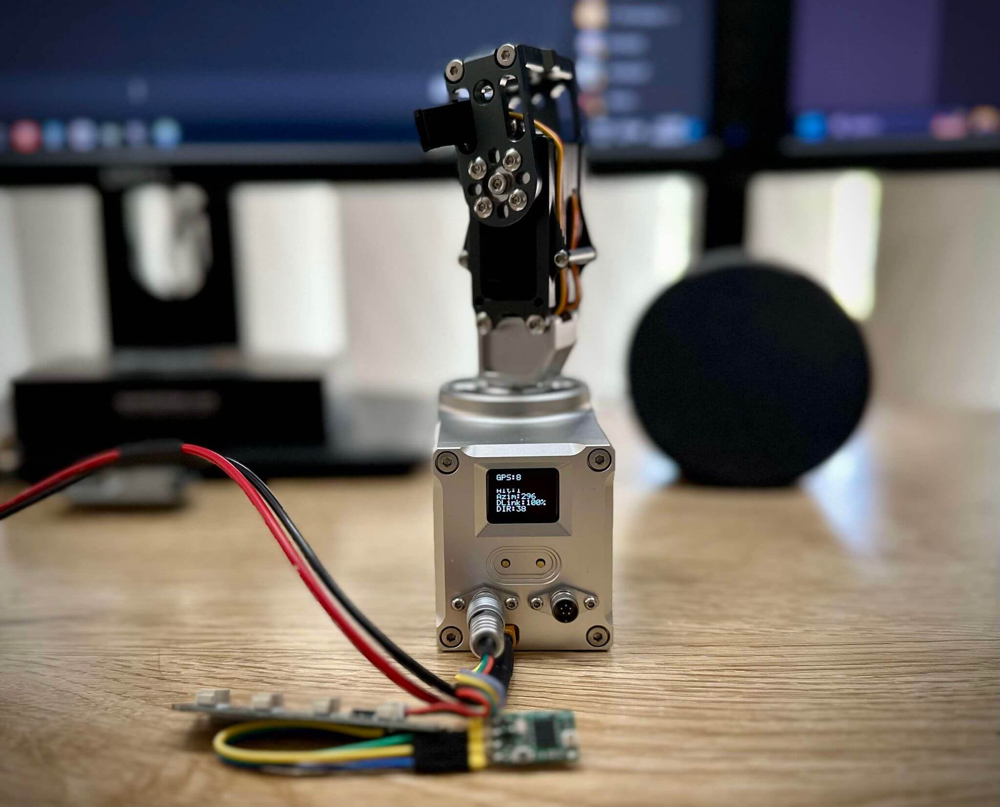
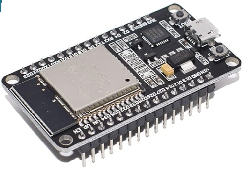
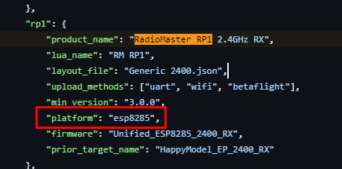
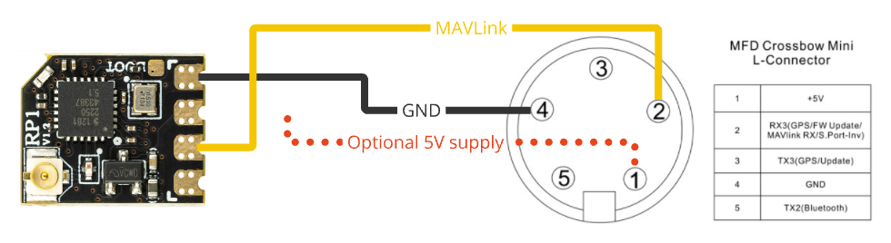
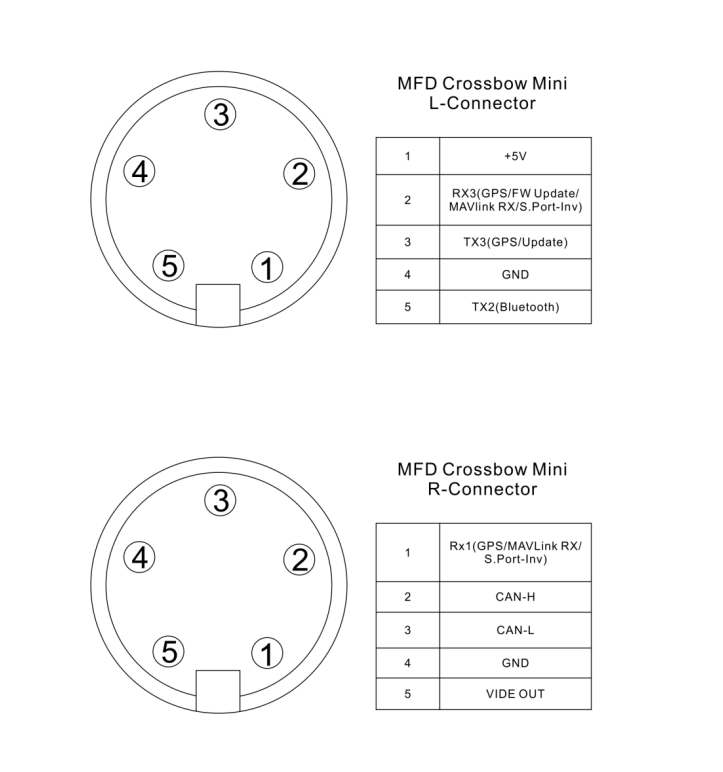
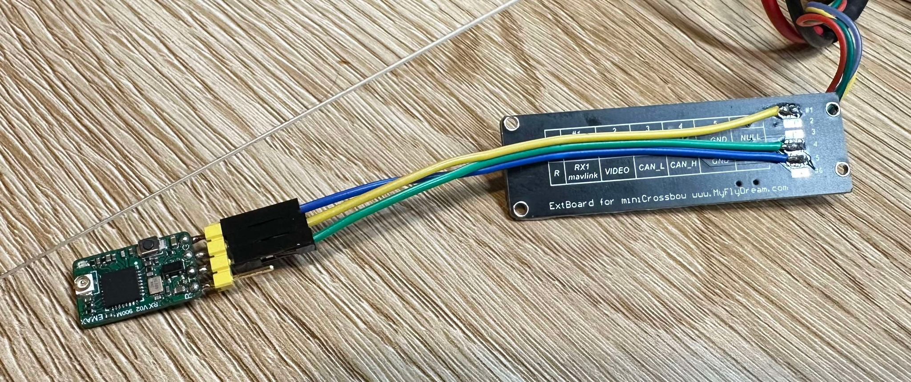

## Introduction
ExpressLRS provides an integration with the MFD [Crossbow](https://myflydream.com/trackers-c-1/crossbow-tracker-p-1) and [mini Crossbow](https://myflydream.com/trackers-c-1/mini-crossbow-p-4) antenna trackers, which wirelessly forwards the telemetry from an ELRS TX module to the Crossbow in order to track the craft.

### How does it work?
In order to forward the telemetry data (that the TX is receiving from the craft) over to the MFD Crossbow, we have leveraged the "Backpack" functionality that is built-in to many ELRS transmitter modules. The Backpack allows an ELRS TX module to communicate with nearby devices using [ESP-NOW](https://www.espressif.com/en/solutions/low-power-solutions/esp-now), which is a peer to peer WiFi-based protocol.

By flashing the `MFD Crossbow Antenna Tracker Backpack` firmware to a receiver, it will now listen for ESP-NOW telemetry packets, and forward them as MAVLink (via UART) to the Crossbow.

When the main ELRS firmware receives the telemetry from the craft, it sends it to the onboard TX-Backpack device, which then broadcasts it via ESP-NOW to any Backpack receivers that are flashed with your bind phrase. The receiver on the Crossbow receives these packets, and is able to track the craft.

### What do I need?
- An ELRS transmitter module with internal TX-Backpack.
- A Backpack-capable receiver - this can be an ESP-based ExpressLRS receiver, or for better WiFi performance, you can also use an ESP32 dev board, etc.
- An MFD Crossbow (mini or full size) tracker
- ELRS LUA script installed on your handset
- A GPS-equipped craft with an ELRS receiver

### What will I need to do to set this up?

To work through this guide, you will need to:

- Update the firmware on your TX and TX-Backpack (depending on your current version)
- Flash an ELRS receiver, or an ESP-based dev board as a Backpack receiver
- Wire the receiver to the Crossbow
- Setup the Crossbow for MAVLink protocol
- Setup ELRS via LUA for telemetry forwarding on the Backpack

## Step 1: Flash Firmware

### Transmitter Firmware
Ensure both your transmitter module, and the embedded Backpack are up to date with the latest release versions:

- For the main ELRS firmware, follow the [Firmware Update Guide](https://www.expresslrs.org/quick-start/getting-started/) for detailed instructions.
- For the TX-Backpack, follow the [Transmitter Backpack Firmware Guide](https://www.expresslrs.org/hardware/backpack/backpack-tx-setup/) for detailed instructions.

The minimum versions to use this feature are:

- Main TX firmware: `3.5.0`
- TX Backpack firmware: `1.5.0`

### Select a Backpack Receiver
Select a Backpack receiver to use on the Crossbow.
Most ExpressLRS receivers will work for this (STM32 receiver cannot be used as they don't have WiFi).

When selecting a receiver for this integration, the quality of the **WiFi antenna** (not to be confused with the ELRS antenna) on the receiver is important if you want decent range (more than 5 meters). Some ELRS receivers have a chip antenna for the onboard WiFi, which helps.

The best receiver for WiFi range is an ESP32 dev board:

<figure markdown>

<figcaption>ESP32 Dev Board</figcaption>
</figure>

These can be found on Amazon for cheap, and have much better WiFi range than a standard ELRS receiver.

Once you have chosen a receiver to use, you need to determine the MCU type that it uses:
- ESP8285 / ESP8266
- ESP32
- ESP32C3
- ESP32S3

If you are using an ELRS receiver, you can look this up (for supported hardware) in the [targets.json](https://github.com/ExpressLRS/targets/blob/master/targets.json) file. Click the [targets.json](https://github.com/ExpressLRS/targets/blob/master/targets.json) link, and then search for your receiver (e.g. `RadioMaster RP1`) and note the `platform` that it uses:

<figure markdown>

<figcaption>Platform for the RadioMaster RP1</figcaption>
</figure>

If you are using an ESP32 dev board, check the listing to see if it's an `ESP32`, an `ESP32C3` or an `ESP32S3`.

### Flash the Backpack Receiver
- Open the ExpressLRS Configurator and select `Backpack` in the left hand menu bar.
- Select the `1.5.0` or newer Backpack Release version from the `Releases` dropdown.
- Select `MFD Crossbow Antenna Tracker Backpack` under `Device category`
- Select `Generic ESPxxxx Receiver` (where "ESPxxxx" is the platform for your receiver type) in the `Device` dropdown
- Enter your Binding Phrase and your Home WiFi SSID and Password (Optional).
- Choose your `Flashing Method` based on your hardware (choose from the options below):

### Flashing via USB/UART

Use this method if you have an FTDI (USB to serial converter), or if you are using an ESP32 dev board connected to the PC via a USB cable.

- Ensure you have the drivers installed for your FTDI, and the device shows up as a COM port in Device Manager when plugged in.
- Connect the receiver to the FTDI:

<figure markdown>

<figcaption>FTDI to receiver wiring</figcaption>
</figure>

- Hold down the BOOT button on the receiver / dev board, or temporarily bridge the BOOT pads if the receive uses pads instead (e.g. with tweezers) as you plug the USB / FTDI into the PC.
- In the Configurator, select the `UART` option under `Flashing Method`.
- Ensure you have completed the steps in the "Flash the Backpack Receiver" section above, then click `Flash` on the ExpressLRS Configurator.
- Wait for the process to complete and you should see the green `Success` notification.

### Flashing via WiFi

If you are flashing an ExpressLRS receiver, you may chose to use WiFi to flash the Backpack firmware.

- Power on the receiver (with no transmitter active), and wait for it to enter WiFi mode (fast flashing LED).
- If you are NOT using Home WiFi, connect to the `ExpressLRS RX` WiFi access point (password is `expresslrs`) and navigate your browser to http://10.0.0.1/?force=true **NOTE THE EXTRA ?force=true ON THE url**
- If you ARE using Home WiFi, navigate your browser to http://elrs_rx.local/?force=true **NOTE THE EXTRA ?force=true ON THE url**
- In the Configurator, select the `WIFI` option under `Flashing Method`.
- Ensure you have completed the steps in the "Flash the Backpack Receiver" section above, then click `Build` on the ExpressLRS Configurator.
- Grab the built `firmware.bin.gz` (do NOT extract it) and drag-and-drop it into the File Upload section of the webpage. If you are using an ESP32 based device, the filename may be `firmware.bin`. Drag-and-drop it into the File Upload section of the webpage.
- Click `Update`. Wait a bit (~10s) for the "Update Success! Rebooting...". The AP should automatically disappear and disconnect.

<figure markdown>

<figcaption>WiFi ESP</figcaption>
</figure>

## Step 2: Wire the receiver to the Crossbow
The receiver communicates via UART with the Crossbow, using the MAVLink protocol at 115200 baud.
We need to wire the `tx` pad on the receiver to one of the `rx` pins on the Crossbow:

<figure markdown>

<figcaption>Crossbow Wiring Diagram</figcaption>
</figure>

The Crossbow mini can communicate via MAVLink on `RX3` or `RX1`, depending on which port you want to use:

<figure markdown>

<figcaption>Crossbow Ports</figcaption>
</figure>

If you use the L-Port on the mini, you also get a +5V and GND source for the receiver:

<figure markdown>

<figcaption>Example Crossbow RX Wiring</figcaption>
</figure>

## Step 3: Configure the Crossbow for MAVLink
Refer to the respective user manual for your model of Crossbow in order to change the UART to MAVLink protocol, at a baud rate of 115200.

For example, on the Crossbow mini, assuming you are using the L-Port:

- Long press the left button to enter the menu
- Short press the left button until you get to `L-Baudrate` and short press the right button to enter
- Short press the left button until `115200` is highlighted, and short press the right button to confirm
- Short press the left button until `Exit` is highlighted, and short press the right button to exit
- Short press the left button until you get to `Protocol` and short press the right button to enter
- Short press the left button until `L:<protocol>` is highlighted, and short press the right button until it reads `L:MAVLink`
- Short press the left button until `Exit` is highlighted, and short press the right button to exit. Do the same again to exit the main menu.

## Step 4: Enable Backpack Telemetry in ELRS LUA Script
1. **Access the LUA Script:**
      - Power on your transmitter and navigate to the System menu.
      - Execute the ELRS LUA script.

2. **Navigate to the Backpack Section:**
      - Scroll to find the "Backpack" section within the LUA script.
      - Select the "Telemetry" option.

3. **Enable Backpack Telemetry:**
      - Set the "Telemetry" option to `ESPNOW`.
      - Exit the script.
      - Your TX module is now configured to broadcast telemetry to the Backpack receiver.

      **NOTE:** Backpack telemetry is transmitted on the 2.4G WiFi band, via ESPNOW (this should have a very limited impact on any LoRa signals, as it is modulated via OFDM like a normal WiFi hotspot). Every telemetry message that your transmitter receives from the craft will be re-transmitted via ESPNOW. You may want to disable Backpack Telemetry to reduce your footprint on the RF noise floor when you aren't using it, especially if you are at something like a race day, where there is often contention on the RF spectrum. Disabling Backpack Telemetry will cause the Crossbow integration to stop working.
      
      To disable Backpack Telemetry (only do this if you are NOT using the Crossbow integration):

      - Execute the ELRS LUA script.
      - Scroll to find the `Backpack` section within the LUA script.
      - Select the "Telemetry" option.
      - Set the "Telemetry" option to `Off`.
      - Exit the script.

## Step 5: Set the Telemetry Ratio
The Crossbow requires frequent GPS coordinate updates in order to track the craft, and to maintain the link.

The recommendation is to use a telemetry ratio of:
- `1:2` or `1:4` if you are using a low packet rate such as 50Hz or 100Hz
- `1:2` to `1:8` if you are using a higher packet rate such as 250Hz or above

To change the telemetry ratio:

- Execute the ELRS LUA script.
- Scroll to find the `Telem Ratio` option.
- Select the ratio as above.
- Exit the script.

## Confirming Operation
Once configured, power up your GPS-equipped craft and establish the link between your ELRS Transmitter and Receiver.
Ensure that GPS telemetry is being received on your handset (go to the `Model` menu in EdgeTX, and inspect the Telemetry page to make sure you are getting GPS coordinates).

The Crossbow status screen should now be showing `DLink:100%` and `GPS:` should reflect the number of sats acquired. Once `GPS:` is greater than 6, press the right button to set home, as per the user manual.

## Troubleshooting
If you encounter issues:

- **No Telemetry Data / DLink:0%:** Ensure the "Telemetry" option is set to `ESPNOW` in the Backpack section of the LUA script and that the firmware is up to date. Also check that your Telemetry Ratio is set to a value that is able to provide frequent telemetry packets. As a rule of thumb, a ratio somewhere between 1:2 to about 1:16 (depending on your packet rate) will suffice. As a troubleshooting step, try 1:2 to guarantee that the tracker is getting regular updates. For more info, see [Packet Rate and Telemetry Ratio](https://www.expresslrs.org/quick-start/transmitters/lua-howto/#packet-rate-and-telemetry-ratio) and [Telemetry](https://www.expresslrs.org/quick-start/pre-1stflight/#telemetry)

- **Binding Issues:** Verify that the bind phrase is correctly set and matches between the Backpack on your transmitter and the Backpack receiver. This should also match the bind phrase that you use for regular ELRS receivers.

- **Interference / Poor Range:** The Backpack Telemetry feature uses a point to point WiFi-based link to forward telemetry. The Backpack receiver should be within 10m of the ELRS transmitter (ideally 5m or less if using an ELRS receiver) for good WiFi signal. Some ELRS transmitters and receivers have better Backpack WiFi antennas than others, so your mileage may vary depending on your hardware. If you are experiencing drops in the link between ELRS and the tracker, try moving the two closer, or consider using an ESP32 dev board as the receiver.
