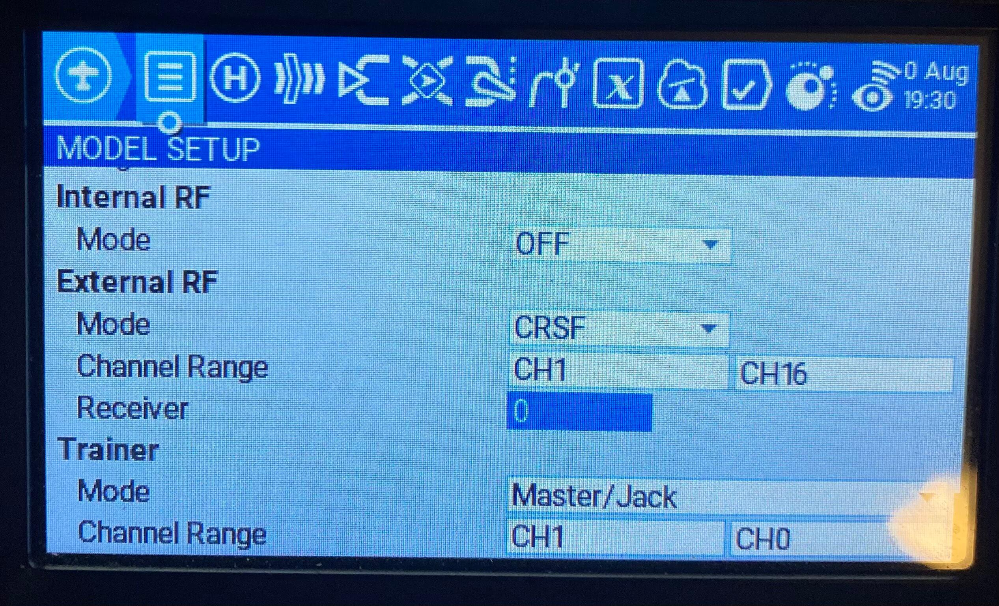

## Model Configuration

ExpressLRS stores separate configurations for each CRSF Receiver number configured in OpenTX/EdgeTX. This can be used with or without model matching - for example, a single drone being used for long-range and freestyle can have its RF params switched quickly by changing the model on the radio. The value is shown highlighted below on a TX16s.

<figure markdown>

</figure>

The parameters stored per-Receiver number are:

| Setting | Description |
|---|---|
| Packet Rate | The RC update frequency (500Hz, 250Hz, etc) |
| Telem Ratio | Telemetry ratio (Off, 1:128, 1:64, etc) |
| Switch Mode | Method for sending switches to the receiver |
| Model Match | Enable the model match feature (see below) |
| Max Power | Transmitter output power level |
| Dynamic Power | Enable Dynamic Power switching |

All other configuration parameters are global across all Receiver numbers. Note: not "per receiver" but "per Receiver number". For details about the configurable parameters, see [Lua Configuration](../quick-start/transmitters/lua-howto.md#understanding-and-using-the-lua-script).

## Model Match

ExpressLRS uses a binding phrase, which means the transmitter will connect to any receiver built with that binding phrase. Model Match is a feature which prevents a full connection if the Model Match number does not match. In this mode, the receiver will connect to the handset, but no data will be sent from the receiver to the flight controller. This allows a user to force that the model selected in OpenTX only connects to a specific receiver, for example preventing using a quad opentx model definition with a fixed wing model.

The terms Receiver number (set in OpenTX/EdgeTX) and Model Match number (set in the receiver) are used interchangeably here-- they are the same.

If the `Model Match` option is **Off**, then only receivers with no Model Match number (255) can be connected. If the `Model Match` option is **On**, then the Receiver number configured in the external module configuration (as shown in the image above) must match the Model Match number stored on the receiver module for the receiver and transmitter to fully connect.

The implementation follows this set of rules for handling half connections / full connections

| TX ModelMatch | TX Receiver ID | RX Model ID | Result |
|---|---|---|---|
| Off | Any | Off | **Connects / Communicates as usual** |
| Off | Any | A | Connects but does not communicate to FC |
| On | Any | Off | Connects but does not communicate to FC |
| On | A | A | **Connects / Communicates as usual** |
| On | B | A | Connects but does not communicate to FC |

### Setting Model Match number

* Set the Receiver number to be used in the OpenTX Model Setup -> External Module -> Receiver
* Be sure the receiver to be assigned is connected and has a high LQ
* Use the ExpressLRS Lua to set the Model Match option to "On"
* The receiver now has its Model Match number set to match the Receiver number and will only fully connect when using this Receiver number.

**_Alternatively_**

* For wifi-enabled RX modules, use the WebUI to set the Model Match directly. "Model Match" must still be set to "On" in the Lua config.

<figure markdown>

</figure>

### Clearing Model Match number

* Be sure the receiver to be assigned is connected and has a high LQ
* Use the ExpressLRS Lua to set the Model Match option to "Off"
* The receiver now has its Model Match number cleared and will connect with any configuration profile which has Model Match set to "Off"

**_Alternatively_**

* For wifi-enabled RX modules, use the WebUI to set the Model Match to 255 to disable matching. "Model Match" must still be set to "Off" in the Lua config.
