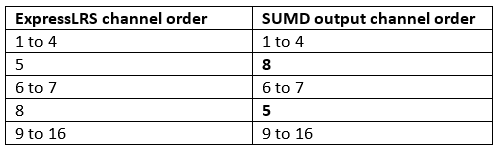
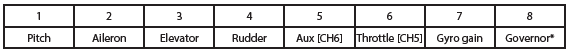
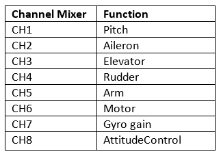

## Description

ExpressLRS receivers can communicate using a variety of serial protocols:

- CRSF (Crossfire) + Inverted
- SBUS + Inverted
- SUMD
- DJI RS2 Pro (Modified SBUS with pre-configured limits)

## Receiver Protocol Selection

!!! note "Note"
    For R9MM and R9-Mini receivers `SBUS`, `DJI RS2 Pro` and `CRSF Inverted` protocols will be output on the SBUS (A2) pad.
    This is a hardware limitation of these receivers, as they do not have software controllable inverters.

On a serial based receiver or a PWM receiver with output pins configured for serial communication (as shown below), the protocol used for serial communication can be selected from the receiver WebUI in the `Serial Protocol` section.

<figure markdown>

</figure>

Alternately, in the Lua script, enter `> Other Devices` and change the value of the `Protocol` field.

<figure markdown>

</figure>

## PWM Receiver Serial Pin Selection

A PWM receiver may also be configured to communicate via serial on two of its pins. The exact pins will vary depending on the receiver. This can be configured in either the receiver WebUI or in the receiver Lua script.

!!! note "Note"
    Not all pins support serial communication. Only the pins that support serial will have the option in the `Mode` dropdown in the WebUI or the `Output Mode` field in the Lua script.

### WebUI

Start the WebUI on the receiver and go to the `Model` tab. From there you will be able to select `Serial TX` or `Serial Rx` on an output pin that supports serial communication.

<figure markdown>

</figure>

Once you've configured the output pins to allow Serial communications you will be presented with a new section, `Serial Protocol`, underneath the `PWM Output` section. In this section you can choose the serial protocol you wish to use.

### Lua Script

When connected to the receiver with the transmitter, enter the ExpressLRS Lua script and select `> Other Devices` then select
`> Output Mapping`. In that screen select the output channel/pin that supports serial (either Serial TX or RX) and set that as the output mode. Setting one automatically enables the other matching pin for serial communications.

<figure markdown>

</figure>

## SUMD Notes

SUMD is the Graupner HoTT bus protocol used to transmit multiple channel data over a single serial line. It transports up to 16 full res channels at a rate of 100Hz and is mainly used to provide digital channel data to Flybarless Control Systems for helicopters and older Flight Controllers.

As already stated many times in this manual, ExpressLRS expects AUX1 (channel 5) to control the arm state. This may lead to a conflict using serial protocols like SUMD in conjunction with devices having fixed channel assignments. To circumvent the problem, SUMD implements a channel remapping by swapping channels 5 and 8 in its serial output:

<figure markdown>

</figure>

This opens the possibility to assign a linear output channel order for channels 1 to 7 using an appropriate OpenTX/EdgeTX mixer setup.

Example: Microbeast flybarless controller without RPM governor. (Follow the Microbeast manual to setup the single line receiver mode.)

Microbeast expected channel order for SRXL/SUMD:

<figure markdown>

</figure>

Required OpenTX/EdgeTX mixer setup to satisfy the Microbeast expected channel order:

<figure markdown>

</figure>

## DJI RS2 Pro Notes

Here's a few things to be aware of when using this Receiver Mode:

- The ELRS tx should be set to 100Hz Full, and switches to 8ch.
- Channels 1, 2, 4 are pan, tilt, roll
- Aux1/CH5 is unused but should be set as an arm switch and left in the unarmed position (Low).
- Aux2/CH6 should be a 3 way switch. From the switch center position to high/low, Rec start/stop or photos can be captured.
- Aux3/CH7 should be a 3 way switch. Each of the 3 positions corresponds to Modes 1, 2 or 3.
- Aux4/CH8 should be a 3 way switch. From the switch center position to high/low, Selfie or Recenter can be activated.
- Rec, photos, recenter, and selfies are done by toggling the switch from the center position to high/low, and back to center in a quick 0.4s movement. With some ETX and mixer magic these functions can be improved and mapped to buttons etc.
- ETX Outputs for the channels should be -100 to 100.

For more information, please see [PR 2140](https://github.com/ExpressLRS/ExpressLRS/pull/2140)
