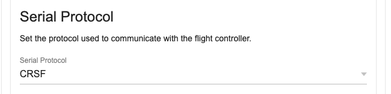
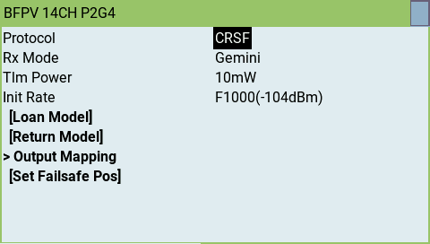

## Description

ExpressLRS receivers can communicate using a variety of serial protocols:

- CRSF (Crossfire) + Inverted
- SBUS + Inverted
- SUMD
- DJI RS2 Pro (Modified SBUS with pre-configured limits)

## Receiver Protocol Selection

!!! note "Note"
    For R9MM and R9-Mini receivers `SBUS`, `DJI RS2 Pro` and `CRSF Inverted` protocols will be output on the SBUS (A2) pad.
    This is a hardware limitation of these receivers, as they do not have software controllable inverters.

On a serial based receiver or a PWM receiver with output pins configured for serial communication (as shown below), the protocol used for serial communication can be selected from the receiver WebUI in the `Serial Protocol` section.

<figure markdown>

</figure>

Alternately, in the Lua script, enter `> Other Devices` and change the value of the `Protocol` field.

<figure markdown>

</figure>

## PWM Receiver Serial Pin Selection

A PWM receiver may also be configured to communicate via serial on two of its pins. The exact pins will vary depending on the receiver. This can be configured in either the receiver WebUI or in the receiver Lua script.

!!! note "Note"
    Not all pins support serial communication. Only the pins that support serial will have the option in the `Mode` dropdown in the WebUI or the `Output Mode` field in the Lua script.

### WebUI

Start the WebUI on the receiver and go to the `Model` tab. From there you will be able to select `Serial TX` or `Serial Rx` on an output pin that supports serial communication.

<figure markdown>

</figure>

Once you've configured the output pins to allow Serial communications you will be presented with a new section, `Serial Protocol`, underneath the `PWM Output` section. In this section you can choose the serial protocol you wish to use.

### Lua Script

When connected to the receiver with the transmitter, enter the ExpressLRS Lua script and select `> Other Devices` then select
`> Output Mapping`. In that screen select the output channel/pin that supports serial (either Serial TX or RX) and set that as the output mode. Setting one automatically enables the other matching pin for serial communications.

<figure markdown>

</figure>
