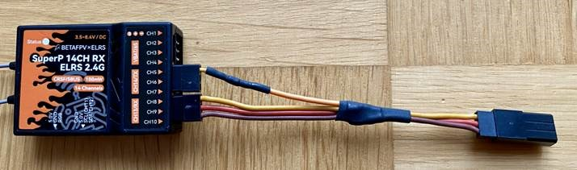

## Description

ExpressLRS receivers can communicate using a variety of serial protocols:

- CRSF (Crossfire) + Inverted
- SBUS + Inverted
- SUMD
- DJI RS2 Pro (Modified SBUS with pre-configured limits)
- HoTT Telemetry

## Receiver Protocol Selection

!!! note "Note"
    For R9MM and R9-Mini receivers `SBUS`, `DJI RS2 Pro` and `CRSF Inverted` protocols will be output on the SBUS (A2) pad.
    This is a hardware limitation of these receivers, as they do not have software controllable inverters.

On a serial based receiver or a PWM receiver with output pins configured for serial communication (as shown below), the protocol used for serial communication can be selected from the receiver WebUI in the `Serial Protocol` section.

<figure markdown>

</figure>

Alternately, in the Lua script, enter `> Other Devices` and change the value of the `Protocol` field.

<figure markdown>

</figure>

## PWM Receiver Serial Pin Selection

A PWM receiver may also be configured to communicate via serial on two of its pins. The exact pins will vary depending on the receiver. This can be configured in either the receiver WebUI or in the receiver Lua script.

!!! note "Note"
    Not all pins support serial communication. Only the pins that support serial will have the option in the `Mode` dropdown in the WebUI or the `Output Mode` field in the Lua script.

### WebUI

Start the WebUI on the receiver and go to the `Model` tab. From there you will be able to select `Serial TX` or `Serial RX` on an output pin that supports serial communication.

<figure markdown>

</figure>

Once you've configured the output pins to allow Serial communications you will be presented with a new section, `Serial Protocol`, underneath the `PWM Output` section. In this section you can choose the serial protocol you wish to use.

### Lua Script

When connected to the receiver with the transmitter, enter the ExpressLRS Lua script and select `> Other Devices` then select
`> Output Mapping`. In that screen select the output channel/pin that supports serial (either Serial TX or RX) and set that as the output mode. Setting one automatically enables the other matching pin for serial communications.

<figure markdown>

</figure>

## SUMD Notes

SUMD is the Graupner HoTT bus protocol used to transmit multiple channel data over a single serial line. It transports up to 16 full res channels at a rate of 100Hz and is mainly used to provide digital channel data to Flybarless Control Systems for helicopters and older Flight Controllers.

As already stated many times in this manual, ExpressLRS expects AUX1 (channel 5) to control the arm state. This may lead to a conflict using serial protocols like SUMD in conjunction with devices having fixed channel assignments. To circumvent the problem, SUMD implements a channel remapping by swapping channels 5 and 8 in its serial output:

<figure markdown>

</figure>

This opens the possibility to assign a linear output channel order for channels 1 to 7 using an appropriate OpenTX/EdgeTX mixer setup.

Example: Microbeast flybarless controller without RPM governor. (Follow the Microbeast manual to setup the single line receiver mode.)

Microbeast expected channel order for SRXL/SUMD:

<figure markdown>

</figure>

Required OpenTX/EdgeTX mixer setup to satisfy the Microbeast expected channel order:

<figure markdown>

</figure>

## DJI RS2 Pro Notes

Here's a few things to be aware of when using this Receiver Mode:

- The ELRS TX should be set to 100Hz Full, and Switch Mode to 8ch.
- Channels 1, 2, 4 are Pan, Tilt, Roll
- Aux1/CH5 is unused but should be set as an arm switch and left in the unarmed position (Low).
- Aux2/CH6 should be a 3 way switch. From the switch center position to high/low, Rec start/stop or photos can be captured.
- Aux3/CH7 should be a 3 way switch. Each of the 3 positions corresponds to Modes 1, 2 or 3.
- Aux4/CH8 should be a 3 way switch. From the switch center position to high/low, Selfie or Recenter can be activated.
- Rec, photos, recenter, and selfies are done by toggling the switch from the center position to high/low, and back to center in a quick 0.4s movement. With some ETX and mixer magic these functions can be improved and mapped to buttons etc.
- ETX Outputs for the channels should be -100 to 100.

For more information, please see [PR 2140](https://github.com/ExpressLRS/ExpressLRS/pull/2140)

## HoTT Telemetry Notes

The HoTT Telemetry Serial Protocol allows to connect multiple Graupner HoTT telemetry devices and intends to support the growing community of ELRS enthusiasts flying fixed wing or helicopter models by providing access to commercially available external telemetry devices without the use of flight controllers or DIY data hubs.

A typical use case for an electric fixed wing model could make use of a the electric Swiss knife SM Unisens-E to downlink flight battery data like voltage, current, consumed capacity and flight data like altitude, vertical velocity while an electric glider pilot could choose a YGE or Graupner telemetry ESC to downlink flight battery data and a GPS/Vario to downlink flight data like GPS position, GPS speed, GPS (MSL) altitude together with barometric vertical velocity and barometric altitude.

HoTT Telemetry example setup - GPS/Vario and Voltage Module connected to ER6:

<figure markdown>

</figure>

Tested receivers:

- BetaFPV Nano RX 2.4 GHz
- BetaFPV SuperD 900Mhz
- BetaFPV SuperP 14ch
- RM ER6 (G and V variants too)
- RM ER8 (G and V variants too)
- Happymodel EPW6

Tested telemetry devices (OEM and 3rd party):

- Graupner 33600 GPS/Vario
- Graupner 336001 Vario
- Graupner 33631 Voltage Module
- Graupner S3046 ESC +T50 (all other +T ESCs work too)
- SM GPSLogger 3
- SM Unisens-E
- SM Microvario (with TEK support)
- YGE 35LVT. ESC (all other YGE Telemetry ESCs will work toos)
- VSpeak Vario Pro
- X-Vario 2

HoTT Telemetry protocol is running on a multi-device capable single wire half duplex bus and requires a bus master to orchestrate the communication between the bus master and the connected devices. The ELRS receiver acts as the bus master communicating with the devices. The bus master uses selected telemetry data to be forward to the ELRS CRSF protocol based over-the-air telemetry down link. The list of additional telemetry sensors provided shows the telemetry sensors available for EdgeTX depending on the specific devices connected to the HoTT Telemetry bus:

- Baro altitude (AGL)
- Baro vertical speed (Vario)

- GPS latitude
- GPS longitude
- GPS groundspeed
- GPS heading
- GPS altitude (MSL)
- GPS number of satellites

- Batt voltage
- Batt current
- Batt capacity
- Batt remaining

To set up HoTT Telemetry the following is required:

- Serial interface enabled (default on some receivers, other receivers need enabling using the WebUI or LUA script)
- Serial Protocol set to HoTT Telemetry
- Adapter cable with a Shottky diode (e.g. BAT43) to allow the serial interface to act as single wire half duplex bus  

The adapter cable is easy to DIY following this schematic:

<figure markdown>

</figure>

Example realization of the adapter cable:

<figure markdown>

</figure>

Example setup BetaFPV SuperP 14ch. Don't forget to enable Serial on ch13/14 using the WebUI or LUA script

<figure markdown>

</figure>
<figure markdown>

</figure>

For Radiomaster RM ER6 and ER8 receivers use the 4-pin CRSF JST connector and the Radiomaster provided pigtail. Serial is already enabled by default.

<figure markdown>

</figure>

