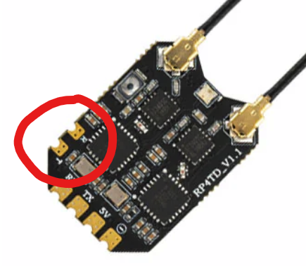

## Description

ExpressLRS receivers can communicate using a variety of serial protocols:

- CRSF (Crossfire) + Inverted
- SBUS + Inverted
- SUMD
- DJI RS2 Pro (Modified SBUS with pre-configured limits)
- HoTT Telemetry
- Tramp
- SmartAudio

## Receiver Protocol Selection

!!! note "Note"
    For R9MM and R9-Mini receivers `SBUS`, `DJI RS2 Pro` and `CRSF Inverted` protocols will be output on the SBUS (A2) pad.
    This is a hardware limitation of these receivers, as they do not have software controllable inverters.

On a serial based receiver or a PWM receiver with output pins configured for serial communication (as shown below), the protocol used for serial communication can be selected from the receiver WebUI in the `Serial Protocol` section.

<figure markdown>

</figure>

Alternately, in the Lua script, enter `> Other Devices` and change the value of the `Protocol` field.

<figure markdown>

</figure>

## PWM Receiver Serial Pin Selection

A PWM receiver may also be configured to communicate via serial on two of its pins. The exact pins will vary depending on the receiver. This can be configured in either the receiver WebUI or in the receiver Lua script.

!!! note "Note"
    Not all pins support serial communication. Only the pins that support serial will have the option in the `Mode` dropdown in the WebUI or the `Output Mode` field in the Lua script.

### WebUI

Start the WebUI on the receiver and go to the `Model` tab. From there you will be able to select `Serial TX` or `Serial RX` on an output pin that supports serial communication.

<figure markdown>

</figure>

Once you've configured the output pins to allow Serial communications you will be presented with a new section, `Serial Protocol`, underneath the `PWM Output` section. In this section you can choose the serial protocol you wish to use.

### Lua Script

When connected to the receiver with the transmitter, enter the ExpressLRS Lua script and select `> Other Devices` then select
`> Output Mapping`. In that screen select the output channel/pin that supports serial (either Serial TX or RX) and set that as the output mode. Setting one automatically enables the other matching pin for serial communications.

<figure markdown>

</figure>

## Second Serial Interface on ESP32 non-PWM and PWM receivers

Starting with firmware version 3.5 an additional serial interface (Serial2) can be assigned on any featured PWM Output or exposed pins of some non-PWM receivers to run any of the available serial protocols. Both serial interfaces can be be used simultaneously. This enables setups like running a CRSF wing stabilization unit and HoTT telemetry, Tramp or SmartAudio at the same time. Serial2 can also be used to simplify the wiring of e.g. an SBUS connection on receivers which have the first serial interface on separate connectors (e.g. RM receivers with JST connectors).

### Assigning Serial2 TX vs Serial2 RX and Serial2 TX

Most of the supported serial protocols are uni-directional (only sending data) or are bi-directional (sending and receiving data) on one single wire (half duplex). For those protocols it is only necessary to assign a TX pin. True (full duplex) serial protocols require the assignment of RX and TX. The following list shows the configuration requirements for the supported protocols:

- CRSF and MAVLINK: require Serial2 TX and additionally Serial2 RX if the device returns data (e.g. telemetry) 
- all others: require Serial2 TX only

### Configuring Serial2 on ESP32 PWM receivers

Serial2 is best configured using the WebUI but can also be configured using the LUA script.

Open the WebUI as described in section "How to get to the Web UI" and scroll down to the PWM Output table. Any PWM Output with the blue Serial2 feature tag can be used to assign Serial2 TX or Serial2 RX. 

<figure markdown>

</figure>

Assign Serial2 TX. If necessary for the serial protocol you intend to run assign Serial2 RX also. In this example we want to run a protocol that only requires Serial2 TX (see above section). Choose Serial2 TX using the Mode drop down list on the desired PWM Output.

<figure markdown>

</figure>

Scroll down a little further. A new line named Serial2 protocol is now available to choose the desired protocol.

<figure markdown>

</figure>

Save the configuration using the SAVE button at the bottom of the page.

Restart the receiver and connect your serial device to the configured PWM Output.

### Configuring Serial2 on ESP32 non-PWM receivers

Some non-PWM receivers like the RadioMaster RP4TD have spare pins exposed. The pins are configured for Serial2 by default. For Serial2 protocol selection use the ELRS LUA script and follow the Protocol 2 section of [Other Devices](https://www.expresslrs.org/quick-start/transmitters/lua-howto/?h=2+protocol#other-devices).

<figure markdown>

</figure>

## SUMD Notes

SUMD is the Graupner HoTT bus protocol used to transmit multiple channel data over a single serial line. It transports up to 16 full res channels at a rate of 100Hz and is mainly used to provide digital channel data to Flybarless Control Systems for helicopters and older Flight Controllers.

As already stated many times in this manual, ExpressLRS expects AUX1 (channel 5) to control the arm state. This may lead to a conflict using serial protocols like SUMD in conjunction with devices having fixed channel assignments. To circumvent the problem, SUMD implements a channel remapping by swapping channels 5 and 8 in its serial output:

<figure markdown>

</figure>

This opens the possibility to assign a linear output channel order for channels 1 to 7 using an appropriate OpenTX/EdgeTX mixer setup.

Example: Microbeast flybarless controller without RPM governor. (Follow the Microbeast manual to setup the single line receiver mode.)

Microbeast expected channel order for SRXL/SUMD:

<figure markdown>

</figure>

Required OpenTX/EdgeTX mixer setup to satisfy the Microbeast expected channel order:

<figure markdown>

</figure>

## DJI RS2 Pro Notes

Here's a few things to be aware of when using this Receiver Mode:

- The ELRS TX should be set to 100Hz Full, and Switch Mode to 8ch.
- Channels 1, 2, 4 are Pan, Tilt, Roll
- Aux1/CH5 is unused but should be set as an arm switch and left in the unarmed position (Low).
- Aux2/CH6 should be a 3 way switch. From the switch center position to high/low, Rec start/stop or photos can be captured.
- Aux3/CH7 should be a 3 way switch. Each of the 3 positions corresponds to Modes 1, 2 or 3.
- Aux4/CH8 should be a 3 way switch. From the switch center position to high/low, Selfie or Recenter can be activated.
- Rec, photos, recenter, and selfies are done by toggling the switch from the center position to high/low, and back to center in a quick 0.4s movement. With some ETX and mixer magic these functions can be improved and mapped to buttons etc.
- ETX Outputs for the channels should be -100 to 100.

For more information, please see [PR 2140](https://github.com/ExpressLRS/ExpressLRS/pull/2140)

## HoTT Telemetry Notes

The HoTT Telemetry Serial Protocol allows to connect multiple Graupner HoTT Telemetry devices and intends to support the growing community of ELRS enthusiasts flying fixed wing or helicopter models by providing access to commercially available external telemetry devices without the use of flight controllers or DIY data hubs.

A typical use case for an electric fixed wing model could make use of a the electric Swiss knife SM Unisens-E to downlink flight battery data like voltage, current, consumed capacity and flight data like altitude, vertical velocity while an electric glider pilot could choose a YGE or Graupner Telemetry ESC to downlink flight battery data and a GPS/Vario to downlink flight data like GPS position, GPS speed, GPS (MSL) altitude together with barometric vertical velocity and barometric altitude.

HoTT Telemetry example setup - GPS/Vario and Voltage Module connected to a RadioMaster ER6 receiver:

<figure markdown>

</figure>

Tested receivers:

ESP8285 platform

- BetaFPV Nano RX 2.4 GHz
- Happymodel EPW6

ESP32 platform

- BetaFPV SuperD 900MHz
- BetaFPV SuperP 14ch
- RM ER6 (G and V variants too)
- RM ER8 (G and V variants too)

Tested HoTT Telemetry devices (OEM and 3rd party):

- Graupner 33600 GPS/Vario
- Graupner 336001 Vario
- Graupner 33631 Voltage Module
- Graupner S3046 ESC +T50 (all other +T ESCs will work too)
- SM GPSLogger 3
- SM Unisens-E
- SM Microvario (with TEK support)
- YGE 35LVT. ESC (all other YGE Telemetry ESCs will work too)
- VSpeak Vario Pro
- X-Vario 2
- VSpeak turbine telemetry (miniumum requirement ExpressLRS firmware V4, EdgeTX firmware 2.11.0)

HoTT Telemetry protocol is running on a multi-device capable single wire half duplex bus and requires a bus master to orchestrate the communication between the bus master and the connected devices. The ELRS receiver acts as the bus master communicating with the devices. The bus master receives selected HoTT Telemetry data to be forward to the ELRS CRSF protocol based over-the-air telemetry down link. The list of additional telemetry sensors provided shows the telemetry sensors available for EdgeTX depending on the HoTT Telemetry devices connected to the HoTT Telemetry bus:

- Baro altitude (AGL)
- Baro vertical speed (Vario)
- GPS latitude
- GPS longitude
- GPS groundspeed
- GPS heading
- GPS altitude (MSL)
- GPS number of satellites
- GPS distance - possible if added as EdgeTX calculated sensor
- GPS traveled distance - possible with LUA script
- Batt voltage
- Batt current
- Batt capacity
- Batt remaining
- additional Temp, Volt and RPM sensors depending on connected HoTT Telemetry devices

Supported VSpeak ESC turbine telemetry sensors:

- ESC ASpd Airspeed 1 = 1km/h (only if ECU provides)
- ESC VOLT0 ECU 1 = 0.1V
- ESC VOLT1 Pump voltage/PWM 1 = 0.1V or 100PWM depending on ECU
- ESC RPM0 RPM	1 = 10 RPM
- ESC RPM2 Fuel in ml 1 = 1ml
- ESC RPM3 Fuel in ml/min 1 = 1ml/min
- ESC TEMP2 EGT 1 = 10C
- ESC TEMP5 Throttle 1 = 1%
- ESC TEMP6 Status ECU specific status table index

Requirements for using HoTT Telemetry:

- The Serial port must be enabled. The Serial port is enabled by default on some receivers, e.g. RadioMaster ER6x/ER8x receivers. On other receivers the Serial port must be enabled using the WebUI or LUA script, see above section WebUI and Lua Script.
- The Serial Protocol must be set to HoTT Telemetry, see above section WebUI and Lua Script.
- On some receivers adapter cables are required.

Adapter cables

If an adapter cable is required depends on the platform the receiver is based on (ESP8285 or ESP32) and the way the serial port is designed on the specific receiver. RadioMaster uses a dedicated JST connector, on other receivers including the BetaFPV SuperP one or two of the PWM servo connectors are used.

ESP32 based receivers with Serial on dedicated PWM servo connectors like the BetaFPV SuperP 14ch:

- No adapter cable is required. HoTT sensors can be directly connected to the PWM servo connector of any of the PWM pins configured for Serial2 TX (see above section).

ESP32 based receivers with Serial on the JST connector.

- RadioMaster ER6x/ER8x need a JST to JR adapter. The JST pigtail RadioMaster included in the package can be used.
- Caveat: the SuperP 14ch also has a JST connector but it can't be used as a Serial port, see the first ESP32 category.
- Alternatively use any of the PWM pins configured for Serial2 (see above section 2).

<figure markdown>

</figure>
<figure markdown>

</figure>

ESP8285 based receivers:

- Require a Schottky diode between Serial RX and Serial TX:  

<figure markdown>

</figure>

Example realization of an adapter cable with diode for ESP8285 non-PWM receivers like the BetaFPV Nano RX:

<figure markdown>

</figure>

Example adapter cable setup for ESP8285 PWM receivers like the Happymodel EPW6:

<figure markdown>

</figure>
