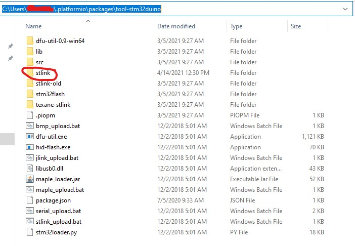

## Overview 

PlatformIO has an older version of STLink. It is unable to communicate with the STM32L MCUs on some RXs.  

### Affected Receivers

- (DIY) PP

Swapping out PIO's STLink folder contents with the current STLink will allow using the configurator with these RXs.

**Go to your STLink folder**

- **Copy contents of "ST-Link Utility"**  
`C:\Program Files (x86)\STMicroelectronics\STM32 ST-LINK Utility\ST-LINK Utility`

- **Paste files from "st-link utility" folder into "stlink" folder in your user PIO location**  
`C:\Users\username\ .platformio\packages\tool-stm32duino`

