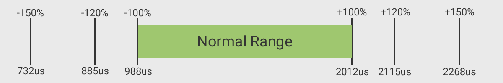
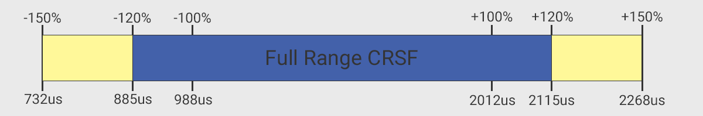

!!! warning "WARNING" 
    **Put your arm switch on AUX1**, and set it as **~1000 is disarmed, ~2000 is armed**.

## Summary of Switch Configuration Modes

This table summarizes the switch configuration modes, available channel switch positions and resolutions, channel update rate, and packet rate as it applies to each channel or flight controller auxiliary channel (Aux). Below the table are descriptions for each option.

| Channel | Flight  Controller | Hybrid | Wide | Full Res  8ch | Full Res  16ch Rate/2 | Full Res  12ch Mixed |
|:---:|:---:|:---:|:---:|:---:|:---:|:---:|
| 1   | Sticks | **Normal Range** | **Normal Range** | **CRSF Ext Limits** | CRSF Ext LimitsH | **CRSF Ext Limits** |
| 2   | Sticks | **Normal Range** | **Normal Range** | **CRSF Ext Limits** | CRSF Ext LimitsH | **CRSF Ext Limits** |
| 3   | Sticks | **Normal Range** | **Normal Range** | **CRSF Ext Limits** | CRSF Ext LimitsH | **CRSF Ext Limits** |
| 4   | Sticks | **Normal Range** | **Normal Range** | **CRSF Ext Limits** | CRSF Ext LimitsH | **CRSF Ext Limits** |
| 5 | Aux 1 | **2-pos Arm** | **2-pos Arm** | **2-pos Arm** | CRSF Ext LimitsH Arm | **2-pos Arm** |
| 6   | Aux 2 | *6-pos*RR | *64/128 -pos*RR | **CRSF Ext Limits** | CRSF Ext LimitsH | CRSF Ext LimitsH |
| 7   | Aux 3 | *6-pos*RR | *64/128 -pos*RR | **CRSF Ext Limits** | CRSF Ext LimitsH | CRSF Ext LimitsH |
| 8   | Aux 4 | *6-pos*RR | *64/128 -pos*RR | **CRSF Ext Limits** | CRSF Ext LimitsH | CRSF Ext LimitsH |
| 9   | Aux 5 | *6-pos*RR | *64/128 -pos*RR | **CRSF Ext Limits** | CRSF Ext LimitsH | CRSF Ext LimitsH |
| 10  | Aux 6 | *6-pos*RR | *64/128 -pos*RR | - | CRSF Ext LimitsH | CRSF Ext LimitsH |
| 11  | Aux 7 | *6-pos*RR | *64/128 -pos*RR | - | CRSF Ext LimitsH | CRSF Ext LimitsH |
| 12  | Aux 8 | *16-pos*RR | *64/128 -pos*RR | - | CRSF Ext LimitsH | CRSF Ext LimitsH |
| 13  | Aux 9 | - | - | - | CRSF Ext LimitsH | CRSF Ext LimitsH |
| 14  | Aux 10 | - | - | - | CRSF Ext LimitsH | - |
| 15  | Aux 11 | - | - | - | CRSF Ext LimitsH | - |
| 16  | Aux 12 | - | - | - | CRSF Ext LimitsH | - |
|  | Packet Rates | 50 thru F1000 | 50 thru F1000 | 100&333 Only | 100&333 Only | 100&333 Only |
 
### Switch Position / Channel Resolution

| Label | Description |
|:---:| --- |
| **Normal Range** | 10-bit or 1024 positions mapped to PWM 988us to 2012us (1 bit = 1us) |
| **CRSF Ext Limits** | 10-bit or 1024 positions mapped to PWM 885us to 2115us (1 bit = 1.23046875us) |
| **64 / 128-pos** | The bit depth is dependent on the selected telemetry ratio. For a telemetry ratio of 1:2 and 1:4 these channels are 6-bit/64 pos. For all other ratios, these channels are 7-bit/128 pos. The 7-bit/128 positions is 12.5% the resolution of 10-bit, and 6-bit/64 positions is 6.25% the resolution of 10-bit. This may not be enough resolution for a head tracker but definitely enough for flight modes, flaps, gear, etc. |
| **16-pos** | 4-bit which is good for flight modes, flaps, gear, etc. |
| **6-pos** | 3-bit which is good for flight modes, flaps, gear, etc. |
| **2-pos** | 1-bit for Arm, ~1000us is the **disarmed** state and ~2000us is the **armed** state (see the explanations below of why the armed state is very important for safety and performance) |

!!! warning "WARNING" 
    **Put your arm switch on AUX1**, and set it as **~1000 is disarmed, ~2000 is armed**.

!!! note
    If using a receiver with PWM outputs and you would like to use the PWM output 5 on the receiver for a servo, gear, etc. Go into the wifi interface of the receiver and map any of the other channels to PWM Output 5. Please always still use AUX1 for the 2-pos Arm switch.

### Channel Update Rate versus Packet Rate

| Label | Description |
|:---:| --- |
| **Bolded** | This channel will be included in every packet at the selected packet rate (So a 150hz Packet Rate = 150hz Channel Update Rate) |
| H   Half Rate | Half of the channels are included in each packet - Rate/2 (So a 100hz Packet Rate cut in half = 50hz Channel Update Rate) |
| RR   Round Robin | These channels wait their turn to be sent in a packet (So a 150hz Packet Rate sends a channel every 7th packet = 22hz Channel Update Rate) |
| 50 thru F1000 | The **Hybrid** and **Wide** switch modes are only available on packet rates of 50Hz, 150Hz, 250Hz, 500Hz, D250Hz, D500Hz, F500Hz, and F1000Hz |
| 100&333 Only | The **Full Resolution** switch modes (**8ch**, **16ch Rate/2**, **12ch Mixed**) are only available on packet rates of 100Hz Full and 333Hz Full |
 
## Detailed Description of Switch Configuration Modes

!!! note
    The switch configuration mode can only be changed when a receiver is not connected to the transmitter and when the transmitter is not armed. The mode is changed using the LUA Configuration in EdgeTX / OpenTX or using buttons, joystick, screen, etc. on the actual transmitter itself. 

ExpressLRS has a few options for how switches are transmitted; Hybrid, Wide, Full Res 8ch, Full Res 16ch Rate/2, Full Res 12ch Mixed.

### Hybrid and Wide Switch Configuration Modes

These two switch modes are only available when packet rates of 50Hz, 150Hz, 250Hz, 500Hz, D250Hz, D500Hz, F500Hz, and F1000Hz and selected.

The stick inputs (Chan 1-4) are sent with every packet at the normal range resolution of 10-bit or 1024 positions mapped to a PWM of 988us to 2012us (1 bit = 1us) which corresponds to -100% and 100% in EdgeTX / OpenTX.

<figure markdown>

</figure>

The first switch (Chan 5 / AUX 1) is sent with every packet. **PUT YOUR ARM ON THIS CHANNEL / AUX 1**. It is used to enable safeguards and performance settings in the software and hardware. See the FAQ below. This switch is 1-bit / 2-position and is mapped to a PWM of **~1000us for disarmed and ~2000us for armed**.

For the remaining 7 switches (Chan 6 thru 12 /  AUX 2 thru AUX 8), only one switch is sent with each packet and is rotated on each packet (Round Robin).

In **Hybrid** mode, AUX2-AUX7 / Chan6-11 are 3-bit and can be used as either 2-position, 3-position, or 6-position switches or selector buttons. These are mapped to a PWM of 1000us to 2000us.

|2-pos Switch |3-pos Switch |6-pos Switch | Approx. Channel Input PWM (us) | Channel Output (us) | Ardupilot Mode
|:--: | :--: | :--: | :--: | :--: | --
|1|1|1|988 | 1000 | Mode1 (up position for 2-pos / 3-pos)
|||2|1192 | 1275 | Mode2
|||3|1398 | 1425 | Mode3
||2|-|1500 | 1500 | Mode4 (center position in 3-pos)
|||4|1602 | 1575 | Mode4
|||5|1807 | 1725 | Mode5
|2|3|6|2012 | 2000 | Mode6 (down position for 2-pos / 3-pos)

In **Hybrid** mode, AUX8 / Chan12 is 4-bit / 16-position and is mapped to the PWM table below. It takes 7 packets to send the complete set of switches before cycling back to AUX2. You can stack all your modes in here, Bardwell style, or get some low-res camera pan action (180 degrees / 16 = 11ish deg per position which isn't terrible). Clever math-heads might note that there's no "center position" (1500us) in a 16-position switch, so using AUX8 with a 3-position switch means it will come out as 1533 at the flight controller.

| Switch Position | 1 | 2 | 3 | 4 | 5 | 6 | 7 | 8 | 9 | 10 | 11 | 12 | 13 | 14 | 15 | 16 | 
|:--:|:--:|:--:|:--:|:--:|:--:|:--:|:--:|:--:|:--:|:--:|:--:|:--:|:--:|:--:|:--:|:--:|
| Approx.&nbsp;Chan&nbsp;Input&nbsp;PWM&nbsp;(us) | 988 | 1056 | 1125 | 1193 | 1261 | 1329 | 1398 | 1466 | 1534 | 1602 | 1671 | 1739 | 1807 | 1875 | 1944 | 2012 | 
| Chan&nbsp;Output&nbsp;PWM&nbsp;(us) | 1000 | 1066 | 1133 | 1200 | 1266 | 1333 | 1400 | 1467 | 1533 | 1600 | 1666 | 1733 | 1800 | 1866 | 1933 | 2000 |

In **Wide** mode, AUX2-AUX8 / Chan6-12 are 6-bit / 64-position for telemetry ratios of 1:2 and 1:4. For all other telemetry ratios, these 7 switches are 7-bit / 128-position. It takes 8 packets to send the complete set of switches before cycling back to AUX2 (one more than **Hybrid**). **Wide** uses the 8th slot to transmit extra data to the receiver, including the current transmitter power. This is the only switch mode which can show the transmitter power `TPwr` on the flight controller's OSD. These behave more like traditional channels although with lower precision. You can tell you're operating in **Wide** mode when a switch in the middle position shows up as 1503 instead of 1500.

If using Ardupilot in **Wide** mode you will see that the channel outputs don't line up very well with the standard -100% (988us) to +100% (2012us) output range in EdgeTX / OpenTX when using a 6-position selector as input. Both the first two and the last two positions get binned into Mode 1 and Mode 6 respectively. To get the full 6 Ardupilot modes, go to the Outputs page on the OpenTX model setup and set the min / max for the channels to -75% / +75%.

### Full Resolution Switch Configuration Modes :new:

These switch modes come in three flavors based on the number of output channels you would like and are only available on packet rates of 100Hz Full and 333Hz Full.

1. **8ch** - Channels 1 to 4 and Channels 6 to 9 are sent 10-bit, at the selected Packet Rate, along with Channel 5 (AUX1) in 1-bit (2-position) for Arming.

2. **16ch Rate/2** - All the Channels are sent 10-bit but at half rate.

3. **12ch Mixed** - Channels 1 to 4 are sent 10-bit with Channel 5 (AUX1) in 1-bit (2-position) for Arming at the selected Packet Rate. Channels 6 to 13 are then sent at 10-bit but at half rate.

All of these 10-bit or 1024 positions are mapped to PWM 885us to 2115us (1 bit = 1.23046875us) in what is called **"CRSF Extended Limits"**

<figure markdown>

</figure>

## FAQ

### Why do you keep saying "*put arm on AUX1*"?

??? Note "Why do you keep saying "*put arm on AUX1*"?"
    For safety and performance reasons.

    **SAFETY**

    AUX1 is sent with every packet going out, this is the most reliable way to be able to tell your model to disarm. If your arm switch is on another aux channel, it may be several packets before that switch is transmitted, and there's no guarantee that the RX will actually receive that packet. There's a non-trivial chance your model **may not ever disarm** if the link quality is low and it just so happens that the packet containing the arm switch is getting missed every time. Forcing the arm switch into every packet on AUX1 means that if **any** packet is received by ExpressLRS, it will disarm your model, not just a less than 1-in-7 chance.

    It also protects against unintentional disarms caused by a corrupt packet changing the value of the arm switch to disarmed. Betaflight requires that 4x "disarm" commands are received before disarming to guard against this possibility. With arm on AUX1, a single corrupt packet can not disarm your model. With arm on AUX2-8, the one corrupt switch value will be sent 6 times before the value is refreshed, but the flight controller would have already disarmed by that point.

    Your transmitter and receiver also act differently when “armed” and when “disarmed”. When disarmed, the transmitter and receiver are free to adjust their communication in order to make the LUA and other configuration operations more responsive. When "disarmed", everything will appear to be working appropriately but none of the safeguards will be in place and performance will not be what you expect. 

    When `IsArmed` is enabled, these safeguards are applied:

    - All "Button" inputs are disabled
    - All "Joystick" (5-way buttons) are disabled
    - Bump to Share is disabled
    - VTX Admin is disabled
    - Integrated VTX channel change is disabled

    **PERFORMANCE**

    When `IsArmed` is enabled, these performance features are activated:

    - Dynamic Power is fully enabled
    - Race telemetry mode turns telemetry off
    - Some thermal-based fan controls are enabled

    Arming is an extremely important part of the performance of the control link. Please use Aux 1 / Chan 5 as indicated. Also keep in mind that for ExpressLRS, ~1000us is the **disarmed** state and ~2000us is the **armed** state.

### I use a 3-pos switch for arm, this software is unusable?

??? Note "I use a 3-pos switch for arm, this software is unusable?"
    Good news, you can still use a 3-position switch to arm! However, you will need to adjust the model input / mixer settings for AUX1 in EdgeTX / OpenTX to remap the switch to be 2-position / on-off switch. If your 3-position arm switch had a second function as well, such as enabling Blackbox, just use one of the other channels to send the same switch on a second channel using the model input / mixer settings EdgeTX / OpenTX.

### What about "Normal" one bit switch mode?

??? Note "What about "Normal" one bit switch mode?"
    In version 1.0 of ExpressLRS, there was also a switch mode called "Normal" where there were eight 1-position switches sent in every packet. This mode was removed in version 2.0 due to its unpopularity and the flash space was used for other features. Please use Hybrid or Wide modes and all of the high performance packet rates.

### Every time I change switch mode in Lua, it changes back! Is my transmitter broken?

??? Note "Every time I change switch mode in Lua, it changes back! Is my transmitter broken?"
    If the Lua loads then you know its communicating with your transmitter. However, the switch mode can only be changed when a receiver is not connected and makes it appear as if the changes are not saving. This is done to ensure consistency between the RX's and TX's interpretation of the switch data being actively transmitted. This is a safeguard. Power down your receiver, wait for the "Telemetry Lost" callout, and the switch mode change will stick / save. The receiver will talk to the transmitted when it is powered up to handshake on the new settings.

