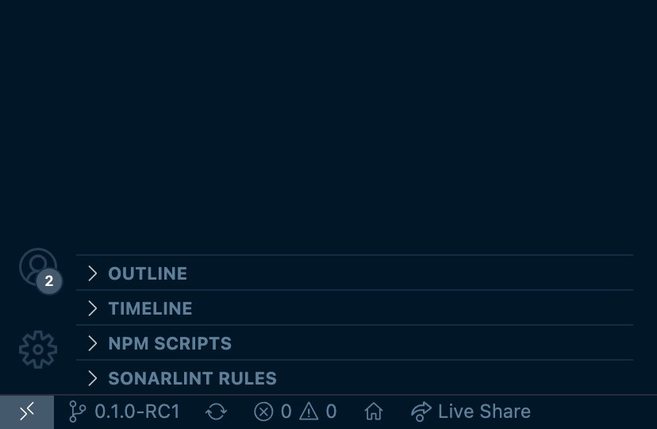

!!! note "Note"
    The following section is intended for advanced users who intend to dabble with the source code directly.

## Toolchain Setup (Advanced)

`ExpressLRS` is written in C++ using the Arduino framework.

 * Rather than using the Arduino IDE (which let's face it, 🗿 is pretty clunky), we use [PlatformIO](https://platformio.org/)
 * To ease the use of `pio` we recommend using the [extension ](https://platformio.org/install/ide?install=vscode)  for `Visual Studio Code`

### PlatformIO

1. 🔽 **Download** a copy of [VSCode](https://code.visualstudio.com/) for your computer
2. 📂 **Open** VSCode, and click on the "__Extensions__" icon in the toolbar on the right (see [Managing Extensions](https://code.visualstudio.com/docs/editor/extension-gallery) 📘)
3. 🔎 In the search box, enter `platformio`, and **install** the **extension** (see [the `pio install` documentation](https://platformio.org/install/ide?install=vscode) 📚)

### Git Setup

We recommend using VSCode's built-in Git client, as it requires the least 3rd party software 🤖.

1. 🔽 **Download** a copy of [git](https://git-scm.com/downloads) (this is also needed for `PlatformIO`)
2. Install `git`, click **yes** to the default options (there are a **LOT** 💯)

!!! important
    Make sure you select this option during installation, it adds git to PATH which is necessary for VSCode cloning (the next step).

<figure markdown>

</figure>

### Cloning the Repo
* In VSCode open the `command palette` (using `Cmd+Shift+P` on MacOS or `Ctrl+Shift+P` on Windows)
* Enter `Git: Clone`

<figure markdown>

</figure>

* Click that! 👈
* Then, enter ExpressLRS Repo URL -> `https://github.com/ExpressLRS/ExpressLRS.git` 💻
* Choose a folder for ExpressLRS. 📂

### Selecting the Latest Release
Before we can do any building, you need to select a release build of ELRS. For example, release [0.1.0-RC1](https://github.com/AlessandroAU/ExpressLRS/releases/tag/0.1.0-RC1). In Visual Studio Code select that tag. The location of the selector is shown below. 🖱️

<figure markdown>

</figure>

<figure markdown>

</figure>

Click the selector, and then type in the name of the tag, in this case `0.1.0-RC1`.

### PlatformIO Building

Once you had the time of your life setting up your toolchain 🧰 you are **ready** to Flash ⚡ ExpressLRS to supported [hardware](https://github.com/AlessandroAU/ExpressLRS/wiki/Supported-Off-The-Shelf-Hardware).

### Building Targets using PlatformIO

1. 📂 When you first launch `Visual Studio Code`, you should see the `PlatformIO Home Page` in a tab.
Click the `Open Project` button. Navigate to the `ExpressLRS` repo directory. Navigate into the `src` folder (i.e. `./ExpressLRS/src/`). Finally, press the `Open` button.
2. ✏️ Edit the file [`./src/user_defines.txt`](https://github.com/AlessandroAU/ExpressLRS/blob/master/src/user_defines.txt) to define user specific variables. 😈 Please make sure you edit the file according to __your__ needs!
3. 📊 In the toolbar on the left, click the PlatformIO icon, which will show the list of tasks. Now, select Project Tasks, expand your desired target and select Build/Upload (depending on the method). You should see the result in the terminal.
4. 🙃 If something went wrong - please check the `Terminal`, too. It will contain at least a hint of what the issue is. Please ask the [community](https://github.com/AlessandroAU/ExpressLRS/wiki#community) for further help🧑‍🔧!

## Updating your Local Repo

You've cloned the repository and are now wondering how to get new updates down the line. Then this document is meant for you!
Here's a primer on how to keep your local copy of the repository up-to-date.

### Method 1: The Clean Way - Fetch & Reset

Probably the **easiest and least troublesome method**, however, it'll overwrite any changes you've made to your local copy. :warning:

1. Open the terminal

    You can either straight up open `bash/cmd` and navigate to your project folder or open an integrated terminal in VSCode:

    - Open the `command palette` (using `Cmd+Shift+P` on MacOS or `Ctrl+Shift+P` on Windows)
    - Enter: `Create New Integrated Terminal`

        <figure markdown>
        
        </figure>

2. In the terminal, type: `git fetch -pu && git reset --hard origin/master`

    This will get you the latest version and destroy any local changes you've made.

### Method 2: The lazy way - Commit, Pull & Merge

The advantage this method has over the first method is that all your changes to the user_defines.txt (or any other file, for that matter) will get merged with any new updates. There's a possibility that, if changes are too big, you could end up with a merge conflict. If that doesn't appeal to you, stick to the first method.

1. Commit your changes to your local repository

    - In VSCode open the `command palette` (using `Cmd+Shift+P` on MacOS or `Ctrl+Shift+P` on Windows)
    - Enter: `Git: Commit`

        VSCode will tell you that there are unstaged changes and ask if you want to add them to the commit. Confirm this! This will just commit your changes to the user_defines.txt to your local repository. No worries, you're not overwriting anything on GitHub! :octocat:

2. Open the terminal, how-to is detailed in method 1

3. In the terminal, type: `git pull -f`

    This will pull a new revision of the remote repository to your local repository and automatically merge it with your changes.

## Avoid user_defines.txt ending up in a commit or getting overwritten

Don't change ``user_defines.txt`` for setting up your local configuration. Instead create a new text file ``super_defines.txt` in the same location as `user_defines.txt` to define your local build configuration. `super_defines.txt` will be git-ignored and will not be part of any commits and won't be overwritten by pulls. Example `super_defines.txt`:

    #-DRegulatory_Domain_EU_CE_2400
    -DRegulatory_Domain_ISM_2400
    #-DRegulatory_Domain_FCC_915
    #-DRegulatory_Domain_EU_868

    -DMY_BINDING_PHRASE="bindphrase"
    -DHOME_WIFI_SSID="ssid"
    -DHOME_WIFI_PASSWORD="password"
    -DLOCK_ON_FIRST_CONNECTION

    -DUART_INVERTED

    !-DAUTO_WIFI_ON_INTERVAL=60
    -DAUTO_WIFI_ON_INTERVAL=40

Note: the `!` flag is called the removal flag. It removes other flags that completely match the text after the `!`.

## Toolchain Setup (Advanced) for Linux Users

!!! note "Note"
    These instructions are meant as a quick start guide for those who develop on Linux.
    Typically developers on Linux don't need much of an explanation and just look for the right commands for the toolchain.
    That's what this guide will provide, without any nudging to use Microsoft VSCode IDE.


### Cloning the Repo
Open a Shell (Bash) in your regular workspace and clone the repo recursively like always and change into that directory.
It is assumed that Linux users know how to use git.

```
git clone --recursive https://github.com/ExpressLRS/ExpressLRS.git
cd ExpressLRS
```

### PlatformIO
PlatformIO is available as a Python package and can be installed via Pip.
Following best practices we will create a virtual environment in the repo directory first.

1. Install virtual-env (just in case it's not installed by default)

```
pip install virtual-env
```

2. Setup a virtual environment to not taint your system's python installation.
It does not matter where you create this but it makes sense to create it in the project directory, because best practice is to have a separate venv for each python project.

```
python -m venv .venv
source .venv/bin/activate
```

3. Install the required python packages. `empy` and `pexpect` are listed because modules like `dronecan` fail to correctly specify
their dependencies for pip to install them automatically.

```
pip install platformio dronecan setuptools empy==3.3.4 pexpect
```

### Building Targets using PlatformIO

The platformio package comes with the [pio](https://docs.platformio.org/en/latest/core/userguide/cmd_run.html) executable.
It is the build command of the toolchain.
`pio` expects a `platformio.ini` file in the directory where it is invoked, so change into src directory first.

There find and open the `user_defines.txt` file in your favorite editor.
This file contains the build flags that you know from ELRS Configurator.
At least uncomment the line for your regulatory domain. That's the minimum requirement for the build to work.
You may also want to set your binding phrase and everything else you would normally set in the ELRS Configurator.

To verify your build environment does work, start building firmware for a common 900Mhz target. It obviously needs a corresponding regulatory domain setting.

```
cd src
pio run --environment Unified_ESP32_900_RX_via_BetaflightPassthrough
```

At some point at the end of the build you will be asked to select some configuration between different manufacturers and products.
This sets parameters to provision a unified software binary with information about the device hardware, e.g. if the device has a power amplifier, diversity, etc. .

When you reach that point, this indicates that everything did work. You can abort with Ctrl-C and Enter now.

### Finding the right configuration for your target

This is the most tricky and obscure part of the ELRS project.
Browsing through the `platformio.ini` file already gives hints about the correct environment, but typically you need to look into the [targets](https://github.com/ExpressLRS/targets) and into the [devices](https://github.com/ExpressLRS/ExpressLRS-Configurator/tree/master/devices) to back-track what the configurator would select for your device.
Another option is to look into the logs of the ELRS Configurator after it flashed your device. You should find the call to pio together with the arguments there.

### Flashing

When you select `--target upload` and provide an `--upload-port`, pio will flash the device as the final step of the build, again asking you about manufacturer / device. Under the hood pio then invokes [esptool](https://github.com/espressif/esptool).

```
pio run --target upload --environment Unified_ESP32_900_RX_via_BetaflightPassthrough --upload-port /dev/ttyUSB0
```

