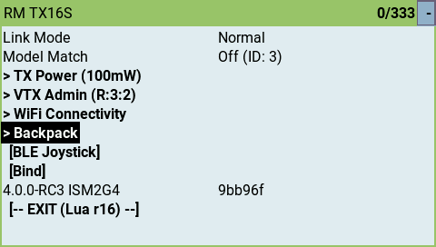
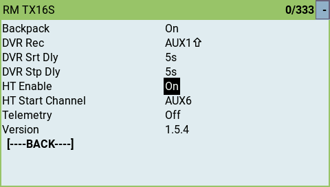
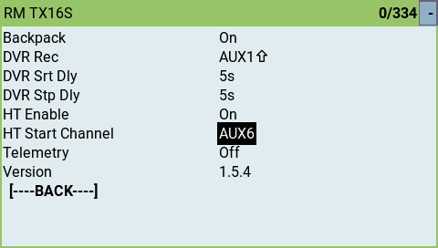
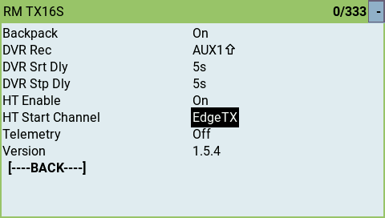
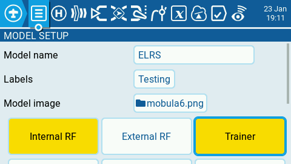
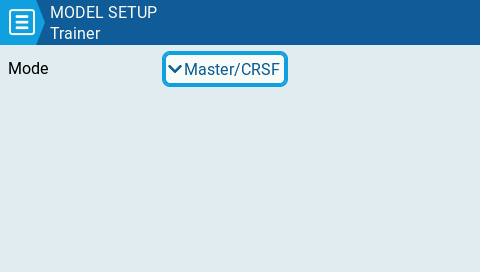
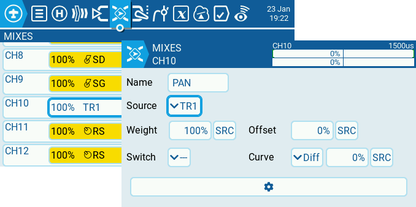
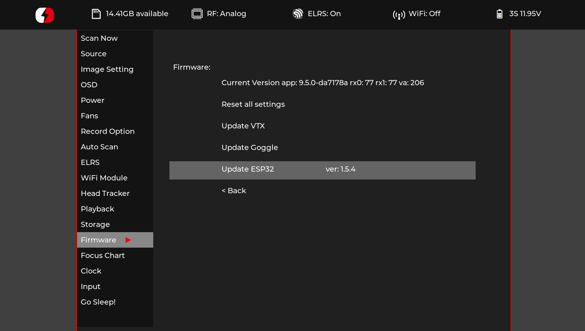
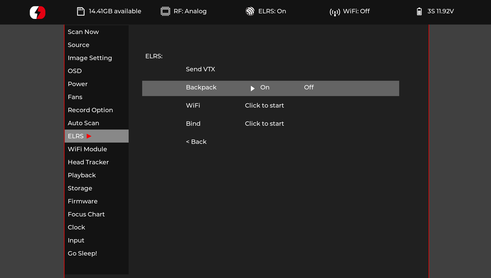

## Overview

The ExpressLRS TX backpack has the ability to receive channel data from external sources/backpacks e.g. the HDZero VRX backpack.
This channel data can be sent back to EdgeTX as trainer inputs, which can then be mixed into output channels or can be configured
to directly override channels before they are sent to a receiver.

## Requirements

- ExpressLRS V4 (minimum)
- TX Backpack 1.5.2 or later
- EdgeTX 2.11 or later

## Handset Setup

In the ExpressLRS Lua script, go to the select the "> Backpack" menu entry

Ensure the Backpack is turned on

Scroll down to "HT Enable" and set this to "On"

### Direct Channel Output
As mentioned above ExpressLRS can override channels directly being sent to the receiver.
To achieve this, set the "HT Start Channel" to a value from "Aux1" to "Aux10".

As an example if you choose AUX6 then the channel overrides will be channels 10 upwards, depending
on the number of channels sent via the backpack. The HDZero goggles output 3 channels for a Pan/Tilt/Roll
head tracker so if "Aux6" is selected for the "HT Start Channel", channels 10, 11, & 12 will be overridden when
sent to the receiver.

!!! note "NOTE"
    It is important to remember that if you must also select a packet rate and switch mode that will actually send all the
    channels you need to the receiver. e.g if you are selecting "Aux6" then you will need to be using either 12ch or 16/2
    channel modes.

### EdgeTX Trainer Input

To pass the channel information from the backpack back to EdgeTX as trainer port data, set the "HT Start Channel" to
"EdgeTX" as in the screenshot below.

To make the trainer channel data available to EdgeTX for using in mixes go to "Model Setup" and select "Trainer" and set
the Mode as "Master/CRSF".

Once this is done you can go to the Mixes tab and set source as a trainer input such as TR1, TR2 etc.

With all this configured, channel 1 coming across the backpack should be mapped to channel 10 on the receiver.

!!! note "NOTE"
    Again, it is important to remember that if you must also select a packet rate and switch mode that will actually send
    all the channels you need to the receiver. e.g if you are mapping TR1 to channel, TR2 to channel 11 etc., then you
    will need to be using either 12ch or 16/2 channel modes.

## Example Usage

### HDZero Goggle head-tracking

This applies to the HDZero Goggle, HDZero Goggle 2 and HDZero BoxPro+ (not the BoxPro as it does not have the backpack)

- Make sure that the goggles backpack is updated with the latest version of the HDZero VRX backpack firmware
  
- In the goggles menu system, go to the "ELRS" section and ensure that the Backpack is "On"
  
- In the "Head Tracker" menu ensure that "Tracking" is set to "On"
  

That should be all that is required to get head-tracking with the HDZero goggles.

### Boost Pedal

An easy to construct wireless pedal that can send a single channel high/low through the ExpressLRS backpack.
This is used for Street League and Underground Drone League RPM BOOST race features, or a Velocidrone
Combat weapons trigger.

For more details, see backpack PR https://github.com/ExpressLRS/Backpack/pull/201.
