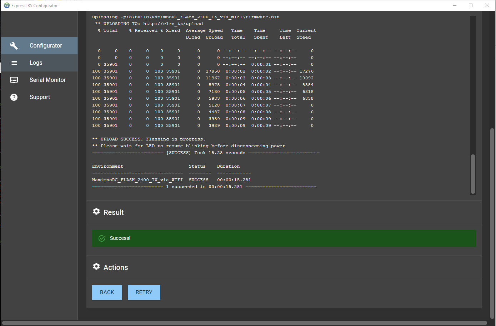

## Flashing Methods

**With the release of v2.0.0, there will be a total of 3 different methods to flash your devices via WiFi**

### Method 1: Hotspot

**Build** your firmware file, either via the ExpressLRS Configurator or PlatformIO. The ExpressLRS Configurator will open a folder for you where the correct firmware file was created and should be named like `<target name>-<version>.bin` (e.g. for the Happymodel ES24TX, the file will be `HappyModel_ES24TX_2400_TX-2.0.0.bin`). Meanwhile, PlatformIO should create the file within the `\src\.pio\build\<target name>\` folder.

Put your device in WiFi Updating mode. For TX modules, this is accomplished using the ExpressLRS Lua Script. Simply select `WiFi Update` from the script and it should start the Update Hotspot. For receivers, power the receiver and wait until `AUTO_WIFI_ON_INTERVAL` time has elapsed and the LED on the receiver is blinking fast.

Connect to the hotspot that the device has created. For Tx modules, this hotspot should show up as **ExpressLRS TX** while for receivers, the hotspot will have a name such as **ExpressLRS RX**. They have the same password: `expresslrs`. 

??? Warning "Updating on Phones"
    In case your computer does not have wifi capabilities, you can use a wifi capable smartphone as well. Most phones will display a notification after a successfull connection. This is because the phone does not recognize an internet connection. It is recommended to acknowledge this notification because the phone might disconnect again.

    On iOS, the WiFi Update Page may open immediately. You can close it via the "Cancel" button on the top right and choose "Use without internet"

    <figure markdown>
    
    </figure>

    On Android, you may see a notification. Click the notification to open the WiFi Update Page and then hit the three dots on the top right and choose "Use this network as is".
    
    <figure markdown>
    
    </figure>

    Now continue with the guide below.

!!! Note
    The receivers, due to their respective sizes, don't have robust WiFi antennas and you will have to bring them closer to the device you're connecting from. The window that opens can easily be closed.

<figure markdown>

</figure>

<figure markdown>

</figure>

Navigate your browser to `http://10.0.0.1/` and the WiFi Update Page should show up.

Using the `Choose File` button, navigate to the folder where the Firmware file is. You can also drag-and-drop the file from the folder window into the Choose File field.

<figure markdown>

</figure>

Click the `Update` button adjacent to the Upload field, and the Update process should commence. A progress bar will be shown to show the status of the Update.

<figure markdown>

</figure>

Once the Update process completes, a Popup should show the result of the Update. Normally, it will show the Success Message. Otherwise, some info will be shown for the reason it failed, like a wrong firmware file, old firmware or a wrong firmware file format.

<figure markdown>

</figure>

**DO NOT** unplug/turn off the device yet. For Tx Modules, wait for the Lua Script to return to its Main Screen, indicating that the Tx Module has rebooted. For receivers, wait until the LED started blinking again, or you can even wait for it to activate WiFi Mode again for good measure.

Additionally, using this same Wifi Update page, you can also configure the receiver to connect to your local Wifi Network, in preparation for the other (better) methods.

<figure markdown>

</figure>

### Method 2: Home Network

This method will only work if the device has been configured to connect to the local Wifi Network, either via the Join Network section in the Hotspot, or it's flashed with a firmware with the Home WiFi Network SSID and Password options set.

**Build** your firmware file, either via the ExpressLRS Configurator or PlatformIO. The ExpressLRS Configurator will open a folder for you where the correct firmware file was created and should be named like `<target name>-<version>.bin` (e.g. for the Happymodel ES24TX, the file will be `HappyModel_ES24TX_2400_TX-2.0.0.bin`). Meanwhile, PlatformIO should create the file within the `\src\.pio\build\<target name>\`.

Put your device in WiFi Updating mode. For TX modules, this is accomplished using the ExpressLRS Lua Script. Simply select `WiFi Update` from the script and it should connect to your WiFi Network. For receivers, power the receiver and wait until `AUTO_WIFI_ON_INTERVAL` time has elapsed and the LED on the receiver is blinking fast.

Using your browser, navigate to the Wifi Update page. For TX Modules, this should be `http://elrs_tx.local` while for receivers, the URL should be `http://elrs_rx.local`.

Using the `Choose File` button, navigate to the folder where the Firmware file is. You can also drag-and-drop the file from the folder window into the Choose File field.

<figure markdown>

</figure>

Click the `Update` button adjacent to the Upload field, and the Update process should commence. A progress bar will be shown to show the status of the Update.

<figure markdown>

</figure>

Once the Update process completes, a Popup should show the result of the Update. Normally, it will show the Success Message. Otherwise, some info will be shown for the reason it failed, like a wrong firmware file, old firmware or a wrong firmware file format.

<figure markdown>

</figure>

**DO NOT** unplug/turn off the device yet. For Tx Modules, wait for the Lua Script to return to its Main Screen, indicating that the Tx Module has rebooted. For receivers, wait until the LED started blinking again, or you can even wait for it to activate WiFi Mode again for good measure.

### Method 3: Build and Flash

This method will only work if the device has been configured to connect to the local Wifi Network, either via the Join Network section in the Hotspot, or it's flashed with a firmware with the Home WiFi Network SSID and Password options set.

Put your device in WiFi Updating mode. For TX modules, this is accomplished using the ExpressLRS Lua Script. Simply select `WiFi Update` from the script and it should start the Update Hotspot. For receivers, power the receiver and wait until `AUTO_WIFI_ON_INTERVAL` time has elapsed and the LED on the receiver is blinking fast. 

Set your User Defines or Firmware Options. Make sure you've selected the correct Target.

With PlatformIO, select **Upload** with the Wifi Target. With the ExpressLRS Configurator, click **Build and Flash**. Wait for the Compile to finish and you should see a section of the log like the image below:

<figure markdown>

</figure>

**DO NOT** unplug/turn off the device yet. For Tx Modules, wait for the Lua Script to return to its Main Screen, indicating that the Tx Module has rebooted. For receivers, wait until the LED started blinking again, or you can even wait for it to activate WiFi Mode again for good measure.
