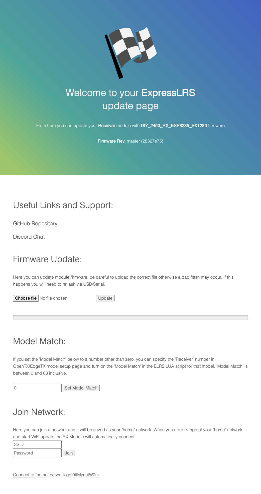

# Firmware Update

1. Click "Choose File"
2. Select `firmware.bin` from your latest build (eg: ...ExpressLRS\src\.pio\build\\[target]\firmware.bin)
3. Click "Update"
4. The progress bar will show the upload progress, once it reaches 100% a dialog will appear showing either success or failure.
In the case of failure, the reason will be displayed in the dialog. A successful upload will ask you to wait for teh LED to start flashing before powering off the module, this is very important and you may soft-brick your module if you power off too early.

See [WiFi Updating](updating/wifi-updating) for more details.

# Model Match _(RX only)_

If using the model-match feature, you can change the model number that you want the receiver to respond to. i.e. if your transmitter does not have the same model number or model-match is disabled in the LUA section then the RX and TX will not connect. Model number 0 will connect if model matching is disabled on the transmitter module.

# Join Network

You can configure a "home network", which when the module enters WiFi mode it will attempt to connect to the home network and if it fails will fall-back to access-point mode. The "SSID" field is used to select a network that the module has scanned for, using auto-complete, or you may manually enter the SSID of the network. Enter the password and press "Join", the module will save the credentials and the module will attempt to connect to the network. If it connects successfully, the web interface will be available at `http://elrs_tx.local` or `http://elrs_rx.local` depending on the module type.

If you are connected to the local network, there will be options to "forget" the home network configuration and re-start the access point, or to disconnect from the home network and start the access point.

