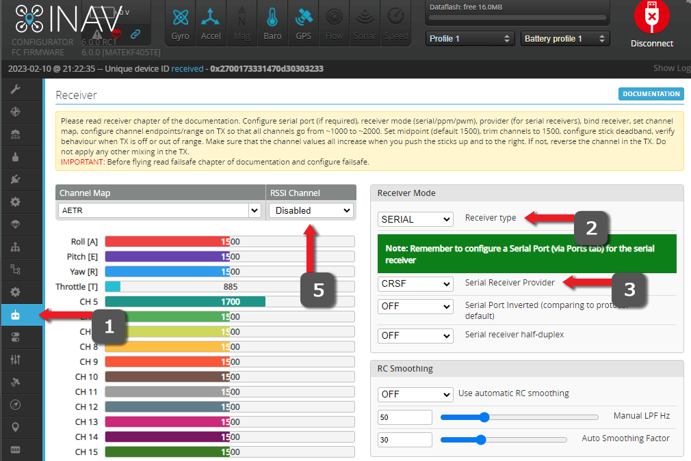

## 串口接收机设置

当你已经完成[接收机接线](wiring-up.md)后，需要在飞控配置工具的 Ports（端口）标签页为接收机所在 UART 启用 Serial RX（串行数字接收机）。

如下例，接收机接在 UART1（TX1 和 RX1 焊盘），则应在 Ports 标签页的 UART1 行勾选 Serial RX（串行数字接收机）。

!!! note "注意"
    这只是示例。请根据你接收机的实际接线情况设置端口。

<figure markdown>

<figcaption>Betaflight 串口设置示例</figcaption>
</figure>

<figure markdown>

<figcaption>INAV 串口设置示例</figcaption>
</figure>

## 串口接收机协议

基于 UART 的 ExpressLRS 接收机使用 CRSF 串口协议与飞控通信。

按以下步骤设置串口接收机协议：

1. 进入飞控配置工具的 ++"Receiver"++（接收机）标签页。
2. 将 `Receiver Mode`(接收机模式) 或 `Receiver Type`(接收机类型) 设置为 {==Serial==}（串口）。
3. 将 `Serial Receiver Provider`(串行数字接收机协议) 设置为 {==CRSF==}。
4. 将 `Telemetry`(遥测) 设置为 {==Enabled==}（启用）。
    - INAV 的 `Telemetry`(遥测) 选项在 ++"Configuration"++（配置）标签页。
5. 如果你用的是模拟图传或支持 MSP DisplayPort/Canvas Mode 的数字图传，请将 `RSSI Channel`(RSSI 通道) 设置为 {==Disabled==}，`RSSI ADC`(模拟 RSSI 输入) 也设置为 {==Disabled==}。

!!! Note
    不同版本的飞控配置工具，这些设置的位置和名称可能会有变化。请参考你的飞控配置工具用户手册。

<figure markdown>

</figure>

<figure markdown>

</figure>

<figure markdown>

</figure>

## 软件反转与全双工模式

CRSF 协议需要完整的 UART 对（TX/RX），且需未反转、全双工。可在飞控配置工具的 ++"CLI"++ 标签页输入 `get serialrx` 检查相关设置：

- `serialrx_inverted` 应为 **OFF**，如需设置请执行 `set serialrx_inverted = off`。
- `serialrx_halfduplex` 应为 **OFF**，如需设置请执行 `set serialrx_halfduplex = off`。
- 设置完成后别忘了输入 `save` 保存。

## RC Link 预设（仅 Betaflight）

Betaflight 飞控支持 RC Link 预设，可根据你的包速率和使用场景自动配置前馈、平滑等相关参数。

!!! Warning
    未使用预设或选择了错误的预设，可能导致前馈信号噪声和抖动，影响飞行手感和性能。

在 **Betaflight 地面站** 中安装 RC Link 预设步骤如下：

1. 选择 **Preset**(预设) 标签页。
2. 在 Preset 标签页点击 **Save Backup**(保存备份)，先保存一份配置备份。
3. 搜索 'ExpressLRS'，选择与你[包速率](../transmitters/lua-howto.md#packet-rate-and-telemetry-ratio)匹配的 Link Preset。如果没有完全匹配的选项，选择低于你包速率的最近预设。

    

4. 展开下拉列表，阅读可选项。注意：这些都是可选项，如无需求可全部不选。
5. 点击 'Pick' 按钮，准备应用预设：

    
    
6. 点击 **Save and Reboot**(保存并重启) 应用预设：

    

!!! important
    配置完成后请关闭飞控配置工具，否则可能影响后续步骤（如 Passthrough 刷写）。在继续下一步前务必拔掉飞控 USB，刷新连接。

飞控配置完成后，可继续下一步：[检查接收机固件版本](./firmware-version.md)。