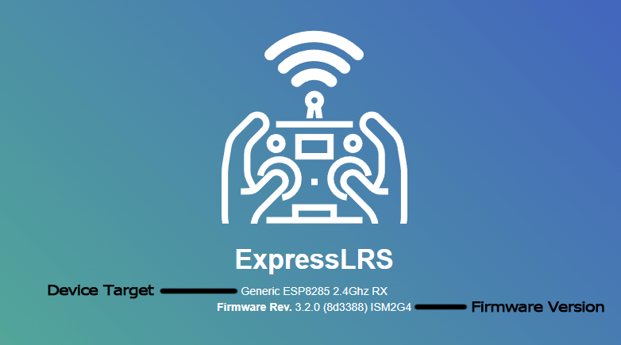
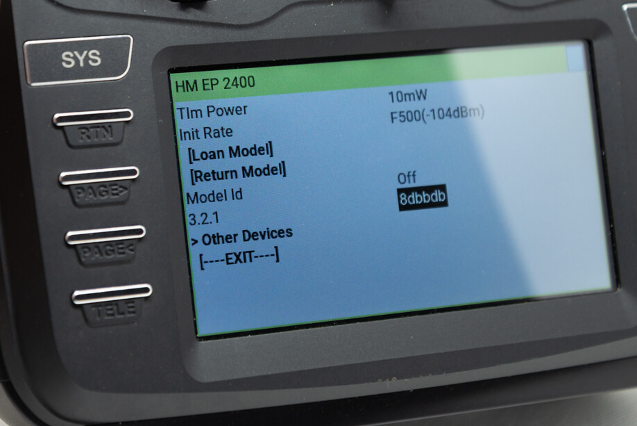
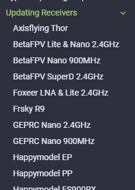

## 为什么要了解固件版本？

了解你设备当前的 ExpressLRS 固件版本，可以决定是否需要升级到新版本，或者可以直接对频无需升级。对于刚入门的新手来说，刷写新设备可能有些困难。

但仍然建议你将设备升级到最新固件，以获得所有的 bug 修复和最新功能。

## 接收机固件版本查询

=== "通过 WebUI 查询"

    1. 让接收机进入 WiFi 模式。

        === "自动 WiFi 模式"

            1. 给接收机通电。

                - 如果需要插电池才能给接收机供电：

                    - 请确保你已检查好前一步的接线。
                    - 确保有风扇吹着图传，也可以暂时断开图传与飞控的连接避免图传过热。

                - 如果接收机已通电并与高频头对频，先关闭遥控器，然后断电再重新上电接收机。

            2. 等待至少 60 秒，LED 会变为快速闪烁或 RGB LED 变为绿色呼吸灯，表示已进入 WiFi 模式。

                - 自动 WiFi 开启间隔选项决定设备上电后多久进入 WiFi 模式（未收到有效 CRSF 包时）。

                <figure markdown>
                
                </figure>

        === "通过 ExpressLRS Lua 脚本"

            !!! Note
                此方法仅适用于接收机已与高频头对频的情况。

            1. 按遥控器上的 ++"SYS"++ 键。
                - 老款遥控器或只有一个菜单键，需长按菜单键进入系统菜单。
                - 具体操作请查阅遥控器说明书。
            2. 进入工具菜单，找到并选择 `ExpressLRS` Lua 脚本。
                - 如果没有该脚本，请从[这里](../transmitters/lua-howto.md)下载并保存到 SD 卡 Scripts/Tools/ 文件夹。
            3. 按 ++enter++ 加载脚本。

                <figure markdown >
                ![Lua Running]
                </figure>

                - 如果脚本卡在 "Loading..."，请返回[设置遥控器](../transmitters/tx-prep.md)页面，确保已正确配置 ExpressLRS。
            4. 下拉选择 `Wifi Connectivity` 并按 ++enter++。
            5. 选择 `Enable RX WiFi` 并按 ++enter++。

                <figure markdown>
                ![Lua WiFi]
                </figure>

            6. 接收机 LED 会变为快速闪烁或 RGB LED 变为绿色呼吸灯，表示已进入 WiFi 模式。

                <figure markdown>
                
                </figure>

    2. 搜索 `ExpressLRS RX` WiFi 热点。
        ![WiFi Hotspot]{ align=right }

        - 如果接收机之前已刷入家庭 WiFi SSID 和密码，并能连接该网络，则不会显示该热点。
        - 热点密码为 `expresslrs`。

        ??? question "找不到热点？（点击展开）"
            如果找不到热点，请确保你的设备支持 2.4GHz WiFi，并尝试让设备靠近一些。

            如果还是找不到，可能是之前设置了家庭 WiFi SSID 和密码，接收机已连接到你的 WiFi 网络。

         

    3. 在浏览器中访问 WebUI，地址如下：
        - http://10.0.0.1/ —— 连接到 `ExpressLRS RX` 热点时使用

            !!! Note
                该 IP 也常被路由器占用。如果电脑有网线连接，可能会打开路由器或 ISP 配置页面而不是 Web UI。

                建议先断开网络或用手机、平板等设备访问。

        - http://elrs_rx.local —— 如果接收机已配置家庭 WiFi 并连接

            !!! Note
                如果无法访问，可能是电脑或网络未启用 MDNS。

            ??? tip "用 IP 地址访问！（点击展开）"
                === "`arp` 命令"

                    1. 打开命令提示符窗口。
                    2. 输入 `arp -a`，查看所有网络设备。
                    3. 依次尝试标记为 `Dynamic` 的 IP 地址，直到打开 ExpressLRS Web UI。

                === "路由器 DHCP 列表"
                    1. 登录路由器后台。
                    2. 查看 DHCP 列表，找到 "elrs" 设备。
                    3. 记下分配的 IP 地址。
                    4. 在浏览器中输入该 IP 地址访问。

    4. WebUI 顶部横幅会显示接收机已刷写的固件版本。

        <figure markdown>
        
        <figcaption>ExpressLRS Web UI 顶部横幅</figcaption>
        </figure>

=== "通过 Lua 脚本查询"

    !!! Note
        此方法仅适用于接收机已与高频头对频的情况。

    1. 按遥控器上的 ++"SYS"++ 键。

        - 老款遥控器或只有一个菜单键的需长按菜单键进入系统菜单。
        - 具体操作请查阅遥控器说明书。

    2. 进入工具菜单，找到并选择 `ExpressLRS` Lua 脚本。

        - 如果没有该脚本，请从[这里](../transmitters/lua-howto.md)下载并保存到 SD 卡 Scripts/Tools/ 文件夹。

    3. 按 ++enter++ 键激活脚本。

        <figure markdown >
        ![Lua Running]
        </figure>

        - 如果脚本卡在 "Loading..."，请返回[设置遥控器](../transmitters/tx-prep.md)页面，确保已正确配置 ExpressLRS。

    4. 下拉到页面底部，选择 `Other Devices`。

    5. 按 ++enter++ 键打开文件夹。

    6. 选择接收机设备并按 ++enter++ 查询参数。

    7. 下图显示接收机固件版本信息。
        - 例如 Happymodel EP 接收机固件版本为 3.2.1，Git Hash 为 8dbbdb。

        <figure markdown>
        
        <figcaption>彩屏遥控器上的接收机版本信息</figcaption>
        </figure>

确定接收机已刷写的固件版本后，你可以决定继续使用还是升级到最新版本。

!!! Info "版本号说明"
    ExpressLRS 固件采用 [语义化版本号](https://semver.org/)。

    格式为 "主版本.次版本.修订号"

        - 主版本：重大新功能和/或不兼容变更
        - 次版本：小功能或增强和/或新目标
        - 修订号：bug 修复

    版本号的第一个数字必须在高频头和接收机之间一致。
    例如：

    - 接收机版本为 3.1.2，可以与高频头固件版本 3.0.1 对频
    - 接收机版本为 3.2.0，**不能**与高频头固件版本 2.4.0 对频

最新 ExpressLRS 固件版本请查阅 [GitHub Releases 页面](https://github.com/ExpressLRS/ExpressLRS/releases)

## 已知版本后怎么做？

=== "版本较旧"

    请参考[下一页](../receivers/updating.md)的常规升级流程，或展开左侧菜单的 `升级接收机` 部分。

    <figure markdown>
    
    </figure>

    你也可以用页面顶部的搜索栏查找你的接收机专用的升级/刷写指南。

=== "版本较新"

    请参考[对频流程](../binding.md)，将接收机与高频头对频。

[Lua Running]: ../../assets/images/lua/config-bw.png
[Lua WiFi]: ../../assets/images/lua/wifi-bw-rx.png
[WiFi Hotspot]: ../../assets/images/WifiHotspot.png