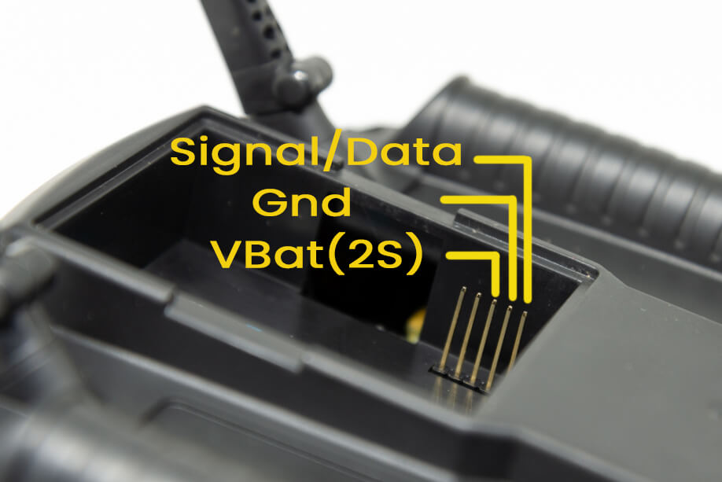
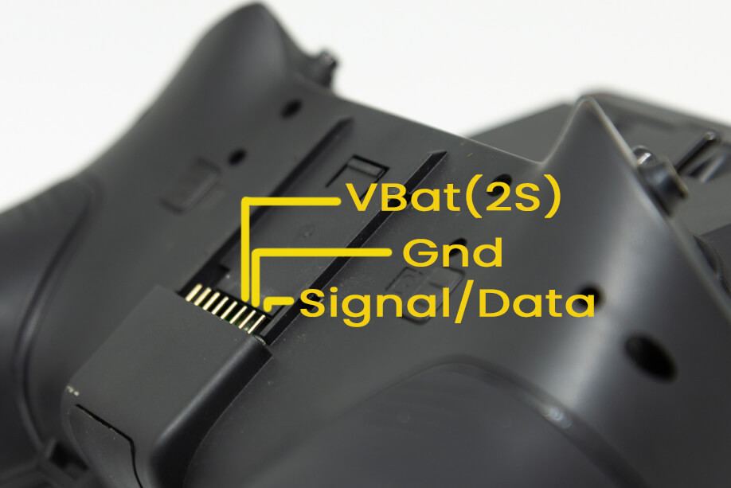
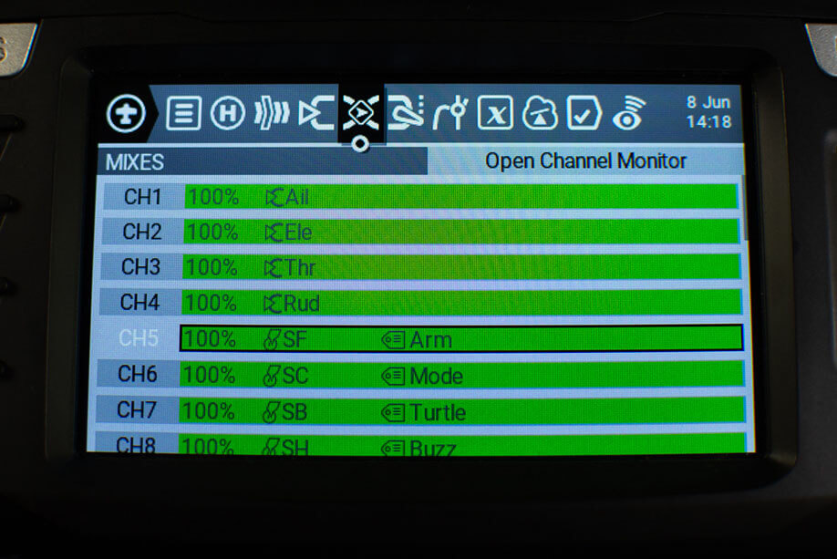

## 外置 ExpressLRS 高频头

将你的外置 ExpressLRS 高频头插入遥控器的外置模块仓，确保所有引脚都未弯曲或缺失。外置 ExpressLRS 高频头需要三根引脚：VCC/VBAT GND S.Port/Data/Signal。

<figure markdown>

<figcaption>Micro 外置模块仓引脚定义</figcaption>
</figure>

<figure markdown>

<figcaption>Nano 外置模块仓引脚定义</figcaption>
</figure>

## 内置 ExpressLRS 高频头

请确保你的新遥控器确实配备了内置 ExpressLRS 高频头。以下机型有 ELRS（ExpressLRS）和4合1版本，有些还有第三种（CC2500）。只有 ELRS 版本支持 ExpressLRS，其他版本因硬件不同无法使用。

- RadioMaster TX16S Mark II（ELRS, 4合1, CC2500）- ELRS 版本包装盒上有 ELRS 标签。
- RadioMaster TX12 Mark II（ELRS, 4合1, CC2500）- ELRS 版本包装盒和 JR 模块仓都有 ELRS 标签。
- RadioMaster Zorro（ELRS, 4合1, CC2500）- ELRS 版本包装盒有 ELRS 标签。
- RadioMaster Boxer（ELRS, 4合1, CC2500）- ELRS 版本包装盒和 JR 模块仓都有 ELRS 标签。
- Jumper T-Lite V2（ELRS, 4合1, CC2500）
- Jumper T-Pro V1/V2（ELRS, 4合1）
- BetaFPV Lite Radio 3 Pro（ELRS, CC2500）- 包底部条码标签可区分 ELRS 或 CC2500 版本。

<figure markdown>

<figcaption>RadioMaster 遥控器 ELRS 标签示例</figcaption>
</figure>

## 遥控器操作系统

ExpressLRS **需要** CRSFShot 或 Mixer Sync 功能，以支持高包速率。建议使用 [OpenTX 2.3.12](https://www.open-tx.org/2021/06/14/opentx-2.3.12) 或更高版本，或 [EdgeTX 2.4.0](https://github.com/EdgeTX/edgetx/releases/tag/v2.4.0) 或更高版本，这些版本已完整支持 CRSFShot/Mixer Sync。

如何查看遥控器操作系统版本：

1. 按下 ++"SYS"++ 键。
    - 老款遥控器或只有一个菜单键，需长按菜单键进入系统菜单。
    - 具体操作请查阅遥控器说明书。
2. 按 ++"PAGE"++ 键，直到进入版本页面。

<figure markdown>

<figcaption>SYS 键，短按进入系统菜单</figcaption>
</figure>

<figure markdown>

<figcaption>菜单键，长按进入系统菜单</figcaption>
</figure>

如果你的系统版本较旧，请先升级到上述推荐版本。  
升级方法请查阅遥控器操作系统升级说明。

强烈推荐使用 [EdgeTX](https://github.com/EdgeTX/edgetx/releases)，兼容性和体验更佳。EdgeTX 支持 One Bit Sample Mode（适用于老款 FrSky 遥控器如 X9D 和 QX7）和 Mega Bauds（高于 400K 的波特率）。

??? Tip "最简单的 EdgeTX 升级流程（点击展开）"
    1. 访问 http://buddy.edgetx.org/
    2. 左侧选择 EdgeTX 版本和你的遥控器型号
    3. 点击页面底部 ++"Download .bin"++ 按钮
    4. 将固件文件保存到遥控器 SD 卡的 `Firmware` 文件夹
    5. 让遥控器进入 Bootloader 模式
        - 关机
        - 将两个水平微调键同时向内拨，再按电源键，屏幕亮起后松开
        - 部分遥控器流程不同，请查阅说明书
    6. 选择 `Write Firmware`
    7. 找到刚下载的 EdgeTX 固件文件
    8. 按照屏幕提示操作
    9. 写入完成后重启遥控器
    10. 在版本页面确认已升级

详细 EdgeTX 安装说明见 [此页面](https://github.com/EdgeTX/edgetx.github.io/wiki/EdgeTX-Installation-Guide)。

## 遥控器设置

### 串口波特率

波特率是遥控器与发射模块通信的速率，单位为比特每秒(bps)。常见波特率有 115200bps(115K)、400000bps(400K)。

波特率越高，通信越快，系统延迟越低。但并非所有遥控器和模块都支持高波特率，具体取决于硬件。

不同遥控器固件可设置不同波特率，具体操作如下：

=== "EdgeTX 内置高频头"

    1. 按 ++"SYS"++ 键
        - 老款遥控器或只有一个菜单键的需长按菜单键进入系统菜单
        - 具体操作请查阅说明书
    2. 按 ++"PAGE"++ 键，进入硬件页面
    3. 下拉找到 `Baudrate` 设置
    4. 按 ++enter++ 键
    5. 用滚轮选择你需要的波特率
    6. 再按一次 ++enter++ 应用
    7. 重启遥控器

    <figure markdown>
    
    <figcaption>EdgeTX 内置模块波特率设置</figcaption>
    </figure>

=== "EdgeTX 外置高频头"

    1. 按 ++"MDL"++ 键
        - 老款遥控器或只有一个菜单键，需短按菜单键进入模型菜单
        - 具体操作请查阅说明书
    2. 按 ++"PAGE"++ 键，进入模型设置页面（彩屏遥控器无需此步）
    3. 下拉找到外置 RF 设置
    4. 选择 `Baudrate` 设置
    5. 按 ++enter++ 键
    6. 用滚轮选择你需要的波特率
    7. 再按一次 ++enter++ 应用
    8. 重启遥控器

    <figure markdown>
    
    <figcaption>EdgeTX 外置模块波特率设置</figcaption>
    </figure>

=== "OpenTX"

    1. 按 ++"SYS"++ 键
        - 老款遥控器或只有一个菜单键的需长按菜单键进入系统菜单
        - 具体操作请查阅说明书
    2. 按 ++"PAGE"++ 键，进入硬件页面
    3. 下拉找到 `Baudrate` 设置
        - 如果没有此设置，说明你的遥控器固件不支持更改波特率，默认锁定为 400000
    4. 按 ++enter++ 键
    5. 用滚轮选择你需要的波特率
    6. 再按一次 ++enter++ 应用
    7. 重启遥控器

    <figure markdown>
    
    <figcaption>老款遥控器波特率设置</figcaption>
    </figure>

#### 推荐波特率

最低波特率取决于你要用的最高包速率：

- 400K(400000bps)：适用于 250Hz 及以下包速率。大多数遥控器和模块都支持。
- 921K(921000bps)：适用于 500Hz 及以下包速率。
- 1.87M(1870000bps)：适用于 F1000 及以下包速率。

部分特殊情况：

- FrSky Taranis QX7 ACCST、Horus X12S、Horus X10S 需做 [CRSF 修改(英文)](https://blog.seidel-philipp.de/fixed-inverter-mod-for-tbs-crossfire-and-frsky-qx7/) 才能稳定运行 400K 波特率。
- FrSky Taranis X9D 即使默认 400K 也不稳定，建议开启 One Bit Sample Mode 并做硬件改造。详见 [X9D 故障排查](../../hardware/x9d-troubleshooting.md)。

其他遥控器可设置更高波特率，具体取决于所用模块。

#### 最大可用波特率

| 内置 TX 模块 | 最大波特率 | 备注 |
| ---- | ---- | ---- |
| RadioMaster TX16S | 5.25M | |
| RadioMaster Zorro | 5.25M | |
| RadioMaster Boxer | 5.25M | |
| RadioMaster Pocket | 5.25M | |
| RadioMaster MT12 | 5.25M | |
| RadioMaster TX12 | 5.25M | |
| Jumper T-Lite V2 | 1.87M | 受限于遥控器 |
| Jumper T-Pro | 1.87M | 受限于遥控器 |
| Jumper T20 | 1.87M | 受限于遥控器 |
| Jumper T14 | 5.25M | |
| Jumper T15 | 5.25M | |
| Jumper T12 Max | 5.25M | |
| BetaFPV Lite Radio 3 Pro | 1.87M | 受限于遥控器 |
| HelloRadio V16 | 5.25M | |

| 外置 TX 模块 | 最大波特率 | 备注 |
| ---- | ---- | ---- |
| Happymodel ES24TX（含 slim, nano 等） | 5.25M | |
| Happymodel ES24TX Pro/Slim Pro | 5.25M | |
| Happymodel ES900TX | 5.25M | |
| Happymodel ES915/868TX | 1.87M | STM芯片 |
| BetaFPV Micro & Nano（V1 & V2） | 5.25M | |
| BetaFPV SuperG | 5.25M | |
| RadioMaster Ranger（含 Micro & Nano） | 5.25M | |
| RadioMaster Bandit（含 Micro & Nano） | 5.25M | |
| Axisflying Thor | 5.25M | |
| EMAX Aeris OLED & Nano | 5.25M | |
| NamimnoRC Flash/Voyager（无 OLED） | 3.75M | STM芯片 |
| NamimnoRC Flash/Voyager OLED | 5.25M | |
| Vantac Lite | 1.87M | |
| Jumper Aion Nano | 1.87M | |
| iFlight Command 8 | 3.75M | 作为外置模块 |
| HGLRC Hermes | 5.25M | |
| HGLRC T ONE OLED | 5.25M | |
| FrSky R9M/R9M Lite/R9M Lite Pro | 1.87M | |
| FrSky R9M 2018（非 ACCESS） | 115K | [电阻改造](../../hardware/inverter-mod.md)可达 400K |
| QuadKopters JR & Slim | 5.25M | |
| SIYI FM30 | 1.87M | STM芯片 |
| ImmersionRC GHOST | 1.87M | STM芯片 |

!!! note "注意"
    外置模块最大波特率还取决于遥控器本身性能。

    老款 QX7 和 X9D(+) 需硬件改造和软件设置（如 One Bit 采样模式）才能稳定高波特率。建议这些老遥控器不要超过 400K。高于 400K 风险自负。

    新款 EdgeTX 遥控器可轻松使用更高波特率，建议尽量用最大波特率。

??? question "我的 TX 模块不在列表里！（点击展开）"
    别着急，说明维护者还没更新。现在新出的 TX 模块基本都是 ESP 芯片。如果你的 TX 模块支持 WiFi 或蓝牙，那就是 ESP 芯片，理论上可支持 5.25M 波特率（取决于遥控器）。

### ADC 滤波器

OpenTX 默认启用 ADC 滤波器，可能导致 RC 命令数据异常（如黑盒日志出现“锯齿”）。建议在 [OpenTX/EdgeTX](https://www.youtube.com/watch?v=ESr2H_EZ89Q) 关闭 ADC 滤波器。

设置方法如下：

1. 按 ++"SYS"++ 键
    - 老款遥控器或只有一个菜单键，需长按菜单键进入系统菜单
    - 具体操作请查阅说明书
2. 按 ++"PAGE"++ 键，进入硬件页面
3. 下拉找到 `ADC Filter` 设置
4. 按 ++enter++ 键切换开关

??? info "EdgeTX 2.7.0（及以上）可按模型单独设置（点击展开）"

    EdgeTX 2.7 及以上支持按模型单独设置（Global、On、Off），适合 PWM 接收机和慢速舵机的固定翼机型。

    1. 按 ++"MDL"++ 键
        - 老款遥控器或只有一个菜单键，需短按菜单键进入模型菜单
        - 具体操作请查阅说明书
    2. 按 ++"PAGE"++ 键，进入模型设置页面（彩屏遥控器无需此步）
    3. 下拉找到 `ADC Filter` 设置
    4. 按 ++enter++ 键
    5. 用滚轮选择 Global（跟随硬件页面设置）、On 或 Off
    6. 再按一次 ++enter++ 应用

## 模型设置

### RF 协议

!!! Note
    如果你用外置 ExpressLRS 高频头，请确保内置 RF 模块**关闭**。

    如果你的遥控器有内置 ExpressLRS 高频头，并且想用它而不是用外置高频头，则需关闭外置 RF 模块，并将内置 RF 模块设置为 **CRSF** 协议。

ExpressLRS 使用 CRSF 串口协议与高频头通信。设置方法如下：

=== "外置 ExpressLRS 高频头"

    1. 按 ++"MDL"++ 键
        - 老款遥控器或只有一个菜单键，需短按菜单键进入模型菜单
        - 具体操作请查阅说明书
    2. 按 ++"PAGE"++ 键，进入模型设置页面（彩屏遥控器无需此步）
    3. 找到内置 RF 设置，设为 Off
    3. 找到外置 RF 设置
    4. 模式设为 `CRSF`
        - 此时可设置波特率
    5. （可选）设置 Receiver ID 为唯一编号
    6. 按 ++"RTN"++ 键或退出模型菜单

    <figure markdown>
    
    </figure>

    <figure markdown>
    
    </figure>

=== "内置 ExpressLRS 高频头"

    1. 按 ++"MDL"++ 键
        - 老款遥控器或只有一个菜单键，需短按菜单键进入模型菜单
        - 具体操作请查阅说明书
    2. 按 ++"PAGE"++ 键，进入模型设置页面（彩屏遥控器无需此步）
    3. 下拉找到内置 RF 设置
    4. 模式设为 `CRSF`
    5. （可选）设置 Receiver ID 为唯一编号
    6. 下拉找到外置 RF 设置，设为 Off
    7. 按 ++"RTN"++ 键或退出模型菜单

    ??? info "没有 CRSF 协议选项？（点击展开）"
        如果找不到 CRSF 协议，请在系统菜单的硬件页面将 `Internal Module Type` 设为 CRSF。

        1. 按 ++"SYS"++ 键
            - 没有 SYS 键的遥控器需长按菜单键进入系统菜单
            - 具体操作请查阅说明书
        2. 按 ++"PAGE"++ 键，进入硬件页面
        3. 下拉找到内置 RF 设置
        4. 类型设为 `CRSF`
            - 此时可设置波特率
        5. 按 ++"RTN"++ 键或退出硬件菜单，再回到模型设置

    <figure markdown>
    
    </figure>

    <figure markdown>
    
    </figure>

!!! Note
    iFlight Commando 8 的 ExpressLRS 并非内置 RF 模块，与 RadioMaster Zorro、TX16S MK2、TX12 MK2、Jumper T-lite V2、T-pro 或 BetaFPV Lite Radio 3 Pro 不同。

    请将内置 RF 模块设为 Off，外置 RF 模块设为 CRSF 协议。

### 开关与辅助通道

新建模型默认没有配置任何辅助通道（Aux 通道从 CH5 开始，前四通道为摇杆）。如果你拨动遥控器上的开关，Betaflight 或 INAV 的模式没有反应，通常是因为没有配置辅助通道。请按以下步骤设置：

1. 按 ++"MDL"++ 键
    - 老款遥控器或只有一个菜单键，需短按菜单键进入模型菜单
    - 具体操作请查阅说明书
2. 按 ++"PAGE"++ 键，进入混控页面
3. 下拉选择要配置的通道
4. 长按 ++enter++，选择 Edit，再按一次 ++enter++
5. （可选）可为该通道命名，方便记忆用途
6. 选择 Source，按 ++enter++ 键
7. 拨动你想分配给该通道的开关
    - 例如 CH5 通常设为解锁开关，建议选用两档开关
8. 再按一次 ++enter++ 键确认
9. 按 ++"RTN"++ 键退出混控编辑器
10. 重复 3-9 步，配置所有需要的开关

=== "单色屏遥控器"

    <figure markdown>
    
    </figure>
    
    <figure markdown>
    
    </figure>

=== "彩屏遥控器"

    <figure markdown>
    
    </figure>

    <figure markdown>
    
    </figure>